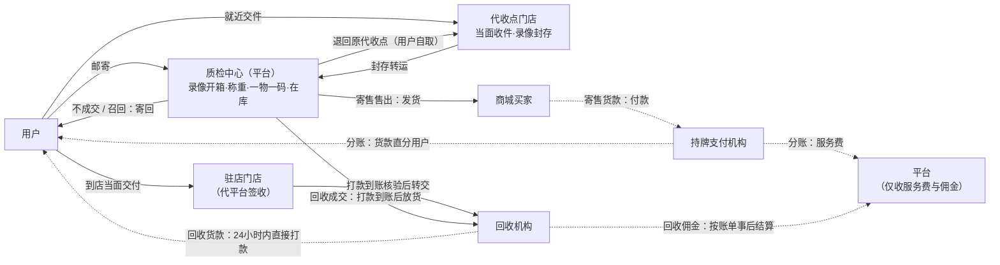
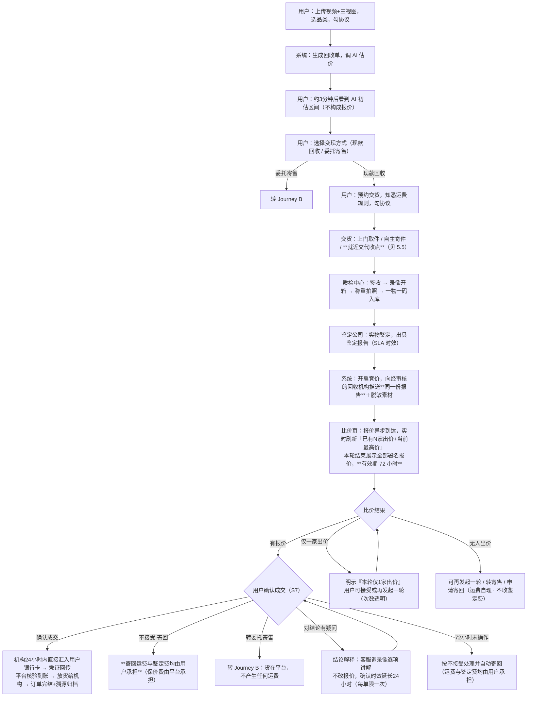
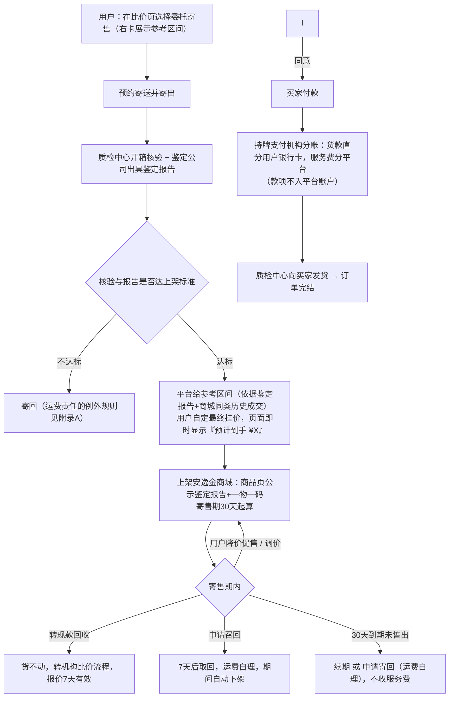
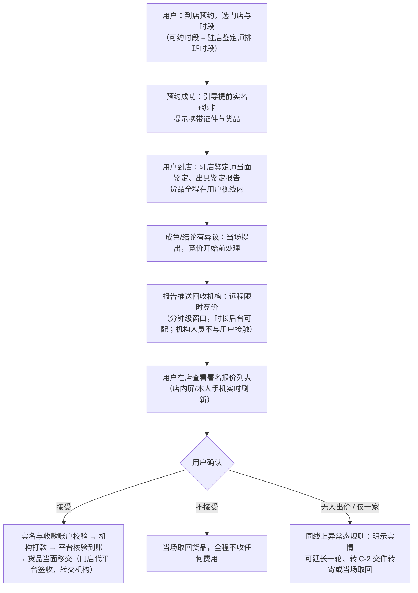
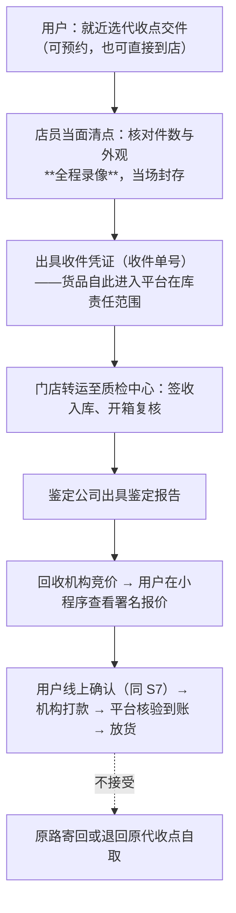
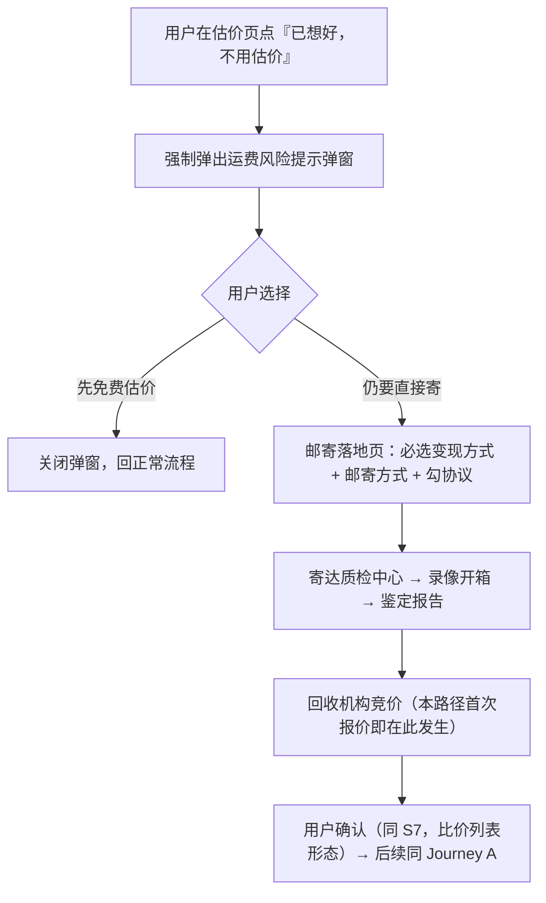
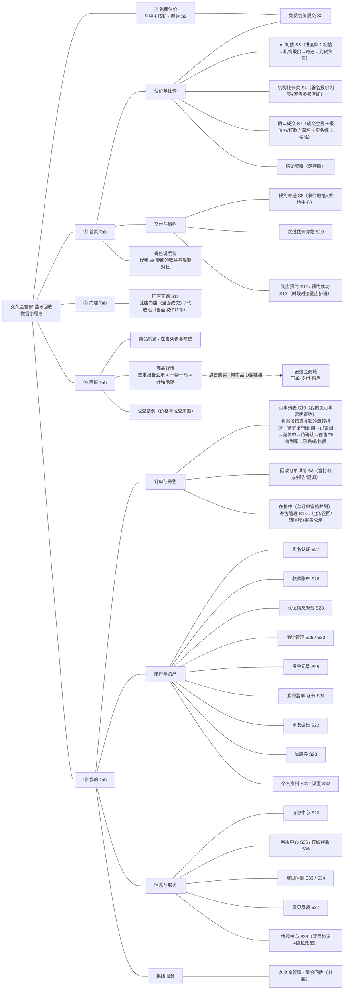
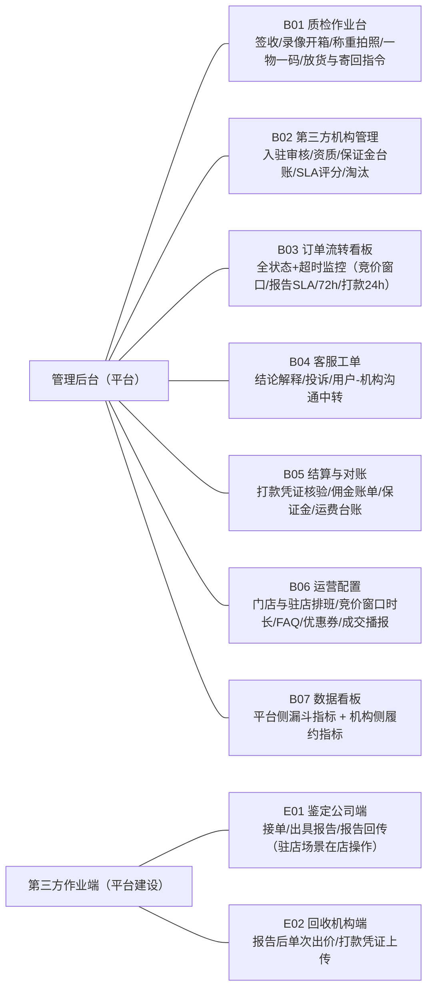

# 久久金翡翠回收 · 产品需求文档

| 项 | 内容 |
|---|---|
| 产品名 | 久久金管家 · 翡翠回收（微信小程序，平台模式） |
| 提交人 | 李恒成 |
| 日期 | 2026-08 |
| 阶段 | MVP，一期未上线 |
| 读者 | 产品／研发／法务／商务／管理层 |
| 关联文件 | 交互原型（改造中）；《久久金翡翠回收-第三方入驻准入清单.md》；竞品调研证据归档《久久金翡翠回收-二手平台机制拆解-深度调研.md》 |
| 完成度 | 第 1–6、14 章已成文；第 7–13 章待原型定稿后编写 |
| 权威声明 | 原型与本文冲突时以本文为准；业务流程以本文第 5 章为唯一权威 |

---

# 1. 需求背景与平台立论

## 1.1 现状与模式选择

久久金集团做黄金回收十年，有 397 家连锁门店、900 万+ 服务客户、成熟的检测与溯源体系，但品类单一，增长见顶。翡翠是与黄金高度同源的另一类家庭闲置贵重品：同样有变现需求、同样缺可信渠道、存量分散在大量家庭中。

**本产品采用平台模式**（2026-08 管理层确定）：引入第三方翡翠鉴定公司与第三方回收机构，平台只做撮合、质检核验与规则监督；回收款由经平台审核的第三方机构直接支付给用户，并明确告知用户付款方身份。选择平台而非自营的根本原因有二：

1. **鉴定能力**：翡翠鉴定专业门槛远高于黄金，无法靠仪器标准化，自建鉴定团队既不经济也不可信；
2. **资金敞口**：自营买断意味着平台持有大量非标存货与价格风险，而平台的中立性——不碰价、不持货款——对非标品交易的价值高于资金实力。

## 1.2 问题

**翡翠没有公开克价。** 黄金按纯度乘重量就能算出价格，翡翠的价值取决于种水、颜色、工艺、尺寸、瑕疵，高度依赖鉴定师经验。由此产生三个现实困境：

| 问题 | 表现 | 严重性 |
|---|---|---|
| 不知道值多少钱 | 用户手里的东西没有任何可参考的价格锚点 | 直接导致「不敢卖」，是转化的第一道墙 |
| 线下报价不透明 | 典当行、玉器店差价悬殊，用户无从判断谁在压价 | 用户对整个行业的默认预期是「会被坑」 |
| 线上无法验真 | 二手平台买卖双方互不信任，货值越高越卖不掉 | 高客单价货品在线上几乎无法成交 |

## 1.3 为什么是平台模式（立论）

传统回收模式下，「报价的人」和「赚差价的人」是同一个——无论商家多克制，用户都有理由怀疑压价，这是整个行业口碑崩坏的结构性原因（见 1.5 竞品对照：置翠的内部评估师取均值、得物被批「运动员兼裁判员」）。本产品把三种角色拆开：

- **鉴定方只出报告、不出价**——报告是事实陈述，不与任何一方的利益挂钩；
- **回收方只出价、不鉴定**——至少两家机构对同一份鉴定报告背对背出价、价高者得，压价者拿不到货；
- **平台只做规则与核验**——货品经质检中心核验、钱不过平台手（机构直付／持牌分账），佣金显性、公示、成交才收。

对翡翠这样没有公开价格的非标品，**「没有人有动机骗你」比「有实力的人向你承诺」更值钱**。集团的门店、资质与溯源能力是重要加分项，但差异化建立在机制上——竞品同样拥有线下实体（见 1.5.1）。

## 1.4 目标用户与核心场景

### 画像

- **主画像 · 家庭闲置翡翠持有人**：35–60 岁普通家庭成员，翡翠来自传承／旅游购买／赠送，非专业玩家。核心困境是**无法判断对方给的价格是否公道**——正是多机构比价直接回答的问题。
- **次画像 A · 有变现规划的翡翠爱好者**：懂行情、多件藏品，委托寄售的主要使用者，愿以周期换价格。
- **次画像 B · 门店周边的到店客户**：倾向当面看、当面谈、当面拿钱；由驻店鉴定师当面出报告、回收机构远程限时报价、在店确认。
- **排除画像**：专业商家／批发商批量出货；未满 18 周岁；无法声明货品来源合法者。
- 第三方鉴定公司与回收机构是平台的**供给侧**，不属于本章用户画像；其准入、作业与考核见后台机构管理模块与附录 B。

### User Story

- A · 我想**先免费知道东西大概值多少钱**，以便决定要不要卖。
- B · 我想**看到不止一家的报价再决定卖给谁**，以便确认自己没有被压价。
- C · 我想**把东西寄出去换成现金**，以便不用出门完成变现——并且清楚知道**钱是谁打给我的**。
- D · 我想**委托代卖而不是卖断**，以便拿到更高价格；买家能看到平台背书的鉴定报告，我的东西才卖得掉。
- E · 我想**知道报价出来之后不会再变，且我随时可以无理由拒绝**，以便不被压价。
- F · 我想**预约到店当面完成整件事**，以便不把贵重物品交给快递。
- G · 成交后我想**看到打款记录、鉴定报告与全流程溯源**，以便确认这次交易可核验。

## 1.5 竞品机制对照

> 本节结论的完整来源链接见归档件《久久金翡翠回收-二手平台机制拆解-深度调研.md》。信息截至 2026-08；标注「无法核实」的条目不得对外引用。

### 1.5.1 直接竞品：置翠与回流

**置翠**（依据其《翡翠交易协议》原文）：协议甲方即揭阳源玉兴，回收为**平台直接买断、现款现结、货权归平台**；寄售走自有直播间／商城，款项经平台账户。防压价手段仅是内部 2–3 位评估师取均值，**无任何多机构竞价**；复检差异的唯一出口是「不同意报价→解除协议原路退还」，**协议中无书面差异举证条款**；寄回须本人签收并录开箱视频否则货损免责（平台免责设计）。2024 年底起已有 6 家线下店／合伙人门店，App 持续迭代，在营。现行寄售抽佣比例无法核实（官方近三年页面均回避数字）；可确认其寄售为「寄售价＋服务费」的**加价差价模式，货主拿到手价**——与红布林同属隐性差价模式。

**结论**：置翠验证了「照片估价＋邮寄回收＋委托寄售」链路在翡翠品类成立，但它是**自营买断**，与本产品的平台模式不同构；且它已有线下实体——本产品的差异化不能建立在「对手没门店没背书」上，而建立在机制差异上：

| 本产品 | 对手现状 |
|---|---|
| 多机构背对背竞价，价高者得 | 置翠：内部评估师取均值；回流：有竞价但预期管理口碑差 |
| 复检差异书面举证 + 二次确认 + 无理由拒绝 | 置翠：只有「接受或退回」 |
| 平台先行赔付（可核验资金安排，卖家与买家双边） | 全行业空位（见 1.5.5） |
| 显性费率 + 挂价即显预计到手价 | 回流翡翠抽 20%；红布林隐性差价 ≥30% |
| **全国门店网络可当面交货**：驻店门店当面成交，其余门店作代收点当面收件、录像封存、转运 | 置翠 6 家门店；回流 46 家门店＋四会基地。线下网络是集团既有资产，竞品无法短期复制——它直接消解「不敢把贵重品交给快递」这道门槛 |

**回流 App**（依据其官方 FAQ 原文）：深圳云长文化科技运营，四会设线下基地，在营。其线上竞拍业务为**居间撮合**（FAQ 原文自认「回流是居间撮合平台」）：买家看货自由给价、不设起拍价，货款成交后**自动实时到账卖家银行卡**，成交才抽佣（**翡翠玉石类 20%**，超 10 万部分 10%），到手价展示制；无传统议价，用「重新竞拍」（原生 2 次机会）代替；参考估价明示「只作竞拍当时参考」；取消寄拍时证书包装盒不返还、查监控付费。**同时在跑门店当场买断**——线上竞价与门店当面双轨并存，与本产品「线上多机构比价＋门店驻店当面收」的组合同构。

**对标结论**：本产品的对标是回流，不是得物。回流证明了「居间撮合＋多方竞价＋直付卖家＋成交抽佣」在珠宝玉翠品类成立；本产品的差异化落在它的薄弱处——其黑猫投诉自 2023-10 至 2026-07 持续存在、近两月月均约 5 条量级，投诉集中处即功能设计的着力点：

| 回流的用户投诉（黑猫投诉原文） | 本产品对应的功能答案 |
|---|---|
| 复拍大幅贬值：平安扣 1200 元中拍，复拍以「氧化磨损」估 500–800，「平台提供的对比图毫无说服力」（2026-03） | 复检差异**书面举证**（瑕疵实拍＋录像时间点）＋二次确认＋无理由拒绝 |
| 估价前后不一：同一主播同一手串先估 800–1200、复拍变 500–800，客服以「主播个人看法不一致」推脱（2025-11） | 报价署名留痕＋预估→最终一致率进机构 SLA 考核（2.2 B 组） |
| 寄回混放无包装盒、手镯碎裂、平台拒担责（2023-10，涉诉 3280 元） | 开箱/封箱全程录像＋附件随货登记＋明确货损赔付标准 |
| 直播标估价 5–8 万、平台自估仅 2–5 万，涉诉 32008 元（2026-06） | AI 初估与回收报价分屏分署名；「算法初估，不构成报价」商业防线 |
| 白玉无事牌有破碎划痕、视频讲解未披露（2026-07） | 寄售商品页**公示鉴定报告**（含瑕疵字段），买家所见即报告所载 |
| 查监控要付费（官方 FAQ 原文） | 开箱录像**用户免费回看** |


### 1.5.2 多机构比价的行业范本（比价页与门店当面报价的设计依据）

非标品的行业共识是「**异步到达＋限时窗口**」，不是车险式秒级同屏。可组合的部件：

| 范本 | 可借鉴的机制 | 对应本产品 |
|---|---|---|
| **爱回收奢侈品百家竞价**：上百家商家独立出价互不可见、15 分钟限时暗拍、卖家可实时观察、可当场拒绝取回、持证鉴定师当面鉴定、**成色异议须在竞价开始前提出** | 鉴定前置→推送→限时暗拍→过程可见→可拒绝的整条链路 | S4 比价页整体；**门店当面报价的直接范本** |
| 土巴兔 | 限定 N 家＋异步到达＋结构化报价可横向对比 | S4 报价卡字段（机构署名／报价／有效期／依据的报告版本） |
| 猪八戒 | 投标期＋到达感提示＋无人应标可关闭 | S4 竞价窗口态与「无报价」出口 |
| 拍机堂 | 成文流拍规则（无人出价自动流拍） | S4 异常态规则母版 |
| 车置宝（已停业） | 反面案例：报价透明度行业领先（车主可见每个买家报价），仍因**货款资金链断裂**崩盘 | 1.6 责任立场：比价透明之外，「钱不过平台手」是更根本的承诺 |

**比价页（S4）设计要点**：①鉴定报告出具后开启限时竞价窗口（时长为后台可配参数，挂机构 SLA），报价异步陆续到达，页面呈现「已有 N 家出价＋当前最高价」实时刷新；②窗口结束展示全部报价列表——**机构署名**、报价、有效期；③三个异常态规则先行：**无人报价→自动流拍**（给转寄售／退回／重新竞价出口）、**仅一家→明示「本轮仅 1 家出价」不伪装成比价**（可延长一轮，次数透明）、**价差过大→平台不解释价格**，只陈列报价与报告字段（中立性红线）；④AI 初估区间与机构报价永远分屏分署名，「算法初估，不构成报价」不可弱化。

**行业信任硬指标**：预估价→到手价一致率（转转 98.6%、爱回收 96.0%）→ 写入机构 SLA 评分维度。

### 1.5.3 得物（先鉴别后交易的机制参照）

个人卖家费率约 5%–20% 浮动＋转账 1%＋固定操作费 38–47 元＋高价封顶 799 元（数字来自 2025 年媒体与用户实测；官方费率表需登录后台查看，引用时须标明为实测口径）；另有「出价 5% 成交变 20%」的公开投诉——**费率不透明本身即是口碑风险**。买家还价缴 2.5% 保证金（14–500 元）、有效期 60 天；**翡翠类目同样适用还价机制**（2026-08 App 实测：翡翠手镯详情页有标准还价入口，保证金实算 1805×2.5%＝45.12 元，与《买家须知》条款一致；还价不分类目、不分品牌直营或个人卖家）。一物一码**必须用得物 App 扫码**（微信扫码只得跳转链接），扫码页显示**已查询次数**。**翡翠类目在营且规格高**：CNAS/CMA 双认证实验室、近 200 个质检点、**逐件称重克重不符直接退回**、CMA 证书带鉴定师签字。防绕单核心不是罚则，而是「实物必经我仓、资金必经我手、沟通可被平台留痕」的结构性隔离——与本产品「货品经质检中心核验＋信息脱敏」同思路。

**可借鉴**：报告随商品公示＋**平台域内闭环扫码**＋查询次数展示（假证书配假查询网站已成产业，验证入口须收在自有域内）；逐件称重作为防调包字段；「多人交叉复核、结论一致才出报告」的作业口径。**须规避**：鉴定方与交易方同体；费率不透明。

### 1.5.4 红布林／只二（寄售链路）

**红布林**（南都 2024-04 实测报道）：现行为「到手价」制——无佣金率表，卖家只确认到手价，平台自行定价营销，差价（常 ≥30%）即平台收益；智能定价自动下调、成交不可撤回（2026 仍在产生投诉）；争议强制北京仲裁；货损仅赔 300–600 元。

**只二**（官方 FAQ 与南都、21 世纪经济报道口径一致）：显性费率与卖家定价权的正面范本——等级佣金 22%/18%/15% 按累计成交额递减、新人首单 17%；**单笔最低 199 元、最高 9999 元封顶**；鉴别服务费 99 元/件。卖家自主定价＋大数据建议价，**现行规则为「卖家可随时调价」**（2024 版协议曾写「公示后不可改」，2025 年已放宽）；买家签收后 T+10 结算。

**对应本产品**：费率表采用显性等级结构并设单笔上下限；挂价时即显示「预计到手 ¥X」；用户可随时自主调价；协议采用法院管辖，在库期间货损按约定价值赔偿；寄售款分账直付，成交即到账。

### 1.5.5 玉石垂类的赔付责任现状

1. **微拍堂把「平台没有赔付义务」写进官方说明**（《中国消费者报》2022-05-30 逐字引用）：「买家应当知悉，微拍堂作为平台并没有对卖家行为的赔付义务」；4200 元赝品仅追回 1000 元保证金的案例属实；江苏省消保委认定该条款违反《电子商务法》《消保法》——**平台先行赔付在合规上是加分项，不是风险项**。另有 2023 年判例支持平台不担连带责任。
2. 玩物得志、东家、华夏收藏网的赔付义务人全部是卖家；「假一赔三／赔十」均为商家承诺。
3. **全行业唯一接近先例：华夏评级对自身鉴定错误按当前市场价值全额赔付**（限钱币品类，上限挂鉴定等级）。其赔付边界条款可直接借鉴进本产品的先行赔付细则：**索赔须封装/证书连同实物返还复核**（对应：赔付以一物一码封装完整为前提）；**每件只赔一次、赔付后货权归公司**（对应：赔付后货权转移）；**物流、溢价等衍生费用不在赔付范围**（对应：赔付范围写死为鉴定结论错误导致的货值损失）。
4. **玉石翡翠类目无任何机构级保真赔付**（NGTC 只出证不赔付）——先行赔付填的就是这个空位。
5. 天天鉴宝（喊「平台鉴定保真」无责任支撑）2022 爆雷关停未恢复；微拍堂鉴真阁「鉴定错误赔 6 倍鉴定费」赔偿锚定鉴定费而非货值，是「假赔付」样板——按货值赔即形成代差。

### 1.5.6 设计输入汇总

1. **差异化着力点**：报告后单次报价（报价即成交价）／免费录像回看／货损赔付标准／显性费率／显性费率与费用责任前置公示（→ 1.6、S7、S16、附录 B）。
2. **比价页按「异步到达＋限时窗口＋实时最高价＋结束后署名列表」设计**，三个异常态规则先行；门店当面报价沿用同一机制（→ 第 9 章 S4、门店三屏）。
3. **先行赔付是全行业空位**，两条文案红线：**不使用「保真」「XX 万保障基金」类表述**，以可核验的资金安排呈现（→ 第 10 章法务文案、附录 B 保证金条款）。
4. **费率照只二显性等级结构＋封顶**，挂价即显预计到手价（→ 收入参数框架、S16）。
5. **资金链路**：钱不过平台手、持牌分账直付（→ 第 11 章分账对接）。
6. **一物一码锚定平台域内闭环验证＋查询计数**，报告字段吸收称重防调包（→ S16、商品页、质检中心字段）。
7. **差异化立论建立在机制差异上**，不建立在线下实体的有无上（→ 1.3／1.5.1）。
8. **预期管理是结构性风险**：AI 初估区间的口径与「算法初估，不构成报价」的呈现强度不可弱化（→ 第 10 章 S3／S4 文案）。


### 1.5.7 对庄翡翠市场（寄卖规则对照，2026-08-12 实测其「了解卖法」页）

同品类唯一把**寄卖规则全文公开**的平台，信息密度高，逐条对过。

#### 费用水位：他们 20%，我们 10%

> 「买家付款后，平台收取成交价的 **15% 作为技术服务费**和成交价的 **5% 作为拍照仓储费用**。」

**拆成两项命名是话术**——15% 听起来比 20% 好接受。**不学这个拆法**（违反「费率显性公示」），但**同行真实水位是 20%** 这个事实，对我们的定价与商务谈判是重要参照：我们 10% 的空间比想象中大。

注意那 **5% 是「拍照仓储费」**——他们为「平台统一拍摄」单独收了钱。这引出下面的 A-20。

#### 值得借鉴的三条

| # | 他们的做法 | 我们的现状 | 建议 |
|---|---|---|---|
| 1 | **「取回费用」是独立章节、明码标价** | 取回的钱散在协议里 ＋ 支付弹层（点了召回才看到金额） | **用户在决定「要不要寄售」时就该知道「反悔要花多少钱」**。这是费用信息不是解释性文案，可以用一个数字表达 |
| 2 | **运费按件数阶梯**：20 件内普通快递 10 元／顺丰 18 元，超出每件 ＋1 元 | ~~写死 ¥28~~ **已改为与去程同一张快递价目表、用户自选**（4.15）；但**「同时召回多件怎么算」仍未定义** | 见 **A-22** |
| 3 | **上架时效给数字**：「预计 3 个工作日左右可上架寄卖」 | **零处承诺** | 我们的链路更长（质检核验 → 第三方鉴定 → 用户定价 → 上架），**正因为长才更该给数字**——用户寄出后最想知道的就是这个 |

#### 他们暴露的两个我们没想到的缺口

- **商品图由谁拍**（→ A-20）：他们把「专业拍摄 · 图物一致」列为服务保障并单收 5%。我们 ② 是用户自拍（用于 AI 初估），**上架商城的商品图由谁拍，零处定义**。
- **买家能不能退货**（→ A-21）：他们明确「不支持悔拍和退货」，并给了理由——**已做真假鉴定与自然光实拍、避免了仙图**。我们买家售后在安逸金，但**退货会让货品回流到我们这边**，寄售单回退到什么状态、运费谁出、重新上架还是寄回卖家，**零处定义**。

#### 不该学的三条

1. **证书费价目表**：4 种材质 × 4 类证书 ＋ a/b/c 三类免收条件——**把内部成本结构直接摊给用户**，读不懂也记不住。正好印证第 10 章文案纪律。
2. **取回还收证书费**（翡翠 5 元/件，有伴钻 8 元/件）：这是**纸质证书工本费，不是鉴定费**——**这一项我们完全对齐**（`CERT_FEE` ¥5/件、含伴钻 ¥8）。当时据此判断「鉴定成本是真金白银」，**2026-08-12 已按这个判断走到底**：不成交一律收鉴定费（4.14），决策二「平台吸收鉴定成本」随之作废。**注意对庄的鉴定本身是免费的（含在其 20% 服务费里），我们是 10% 费率 ＋ 成本用户自理——两条不同的路，对外须先说费率差。**
3. **钱包 ＋ 2 个工作日提现**：我们是**买家付款后由银行直接汇入卖家账户、不设钱包**——既避开二清，到账也更快。**这是我们的优势，应写进对外对比材料。**


#### 第二批实测（2026-08-12）：上架标准与两种卖法

##### ⚠️ 对照出我们一个法律与体验的双重风险

《寄售交易协议》一-1 写着：

> 「核验或报告**不达上架标准**的，平台安排寄回，**寄回运费由您承担**。」

**但「上架标准」全站与 PRD 零处定义。** 用户在寄货之前根本不知道什么会被拒收，寄到了才被告知「不合格、运费你出」——**未事先告知的拒收标准 ＋ 让用户承担寄回运费，是标准的争议来源**。

对庄的做法正相反：**把上架标准在寄之前全列出来**，四类拒收原因各自列明。这是本次最该借鉴的一条，**已照此落地（→ 4.13）**。

##### 他们的拒收标准（四类）

| 类别 | 内容 |
|---|---|
| 法律禁售 | 文物（含仿制品）、象牙、玳瑁、犀牛角、珊瑚、砗磲 |
| 非天然／达不到定名／杂质过多 | 充填注胶（B 货）、染色（C 货）、合成或再造宝玉石 |
| 无法通过外表判断品质、或颜色成因存在争议 | 原石、半成品（毛货）、翡翠烧红、宝石疑似改色（辐照与扩散） |
| 品质不达标 | **非可售款式**：原石、半成品、把件、**摆件**、仿大牌；**非可售镶嵌**：金镶玉（金箔）、非贵金属镶嵌；**翡翠**：豆种、料子粗、脏点多、发黑发灰、种水欠佳、变种、雕工差、**料子薄（裸挂件 <2.5mm、手镯厚度 <4mm）**、残损件；**市场估价 ¥1000 及以下** |

三条值得单独拎出来：

1. **「市场估价 ¥1000 及以下」不收**——这是**成本线，不是品味线**。我们服务费 10%，一件 ¥1000 的货成交只收 ¥100，而单件成本包含：第三方鉴定费、平台承担的保价费、开箱／封箱录像留存 180 天、寄售期仓储 30 天、（若平台拍摄）拍照成本，不成交时还可能有平台承担的回程运费。**¥100 很可能覆盖不了。**
   > 决策二定的是「所有寄到的货一律出具正式报告」，成本由平台吸收——**这条在没有价值下限时是无底的**。回收侧同样成立。
2. **料子薄的物理门槛**（裸挂件 <2.5mm、手镯厚度 <4mm）——具体到毫米，说明踩过坑：薄件运输与佩戴都易碎，一碎就是全额赔付。
3. **摆件、把件属「非可售款式」**——而我们 ⑫ 的携带物品清单写的是「翡翠手镯 / 吊坠 / 珠串 / 挂件 / **摆件**等」。摆件体积大、运费高、鉴定与估值难、流动性差，**是否该收要重估**。→ 已定（4.13）：**寄售不收、回收仍收**，⑫ 携带清单不必改。

##### 我们原先的口径：来者不拒（已废止）

原 FAQ 写的是「天然 A 货翡翠均可回收；**B 货、C 货鉴定报告中会如实标注，机构据此单独报价**」——**回收侧全收**。

**2026-08-12 决策：与对庄一致，两侧均不收 B/C 货**（→ 4.13）。曾考虑把回收侧的宽口径当差异化卖点保留，
但每件 B 货都要走完鉴定、开箱录像、仓储全套流程、而成交额极低，**平台吸收的成本收不回来**；
对庄以 20% 服务费尚且不收，我们 10% 更没有理由收。

##### 两种卖法：竞拍 vs 一口价

| | 竞拍 | 一口价 |
|---|---|---|
| 优势 | 多人同时竞价，卖得快 | 多渠道同时卖，价更高 |
| 周期 | **平均 72 小时内售出** | **平均 7 天内售出** |

注意他们的「竞拍」是**买家侧多人竞价**，与我们的**机构侧竞价**（回收线）不是一回事。我们的寄售等同于他们的「一口价」。

**一期不做买家侧竞拍**：竞拍要成立需要**同一件货同时有多个买家盯着**，而我们的买家在安逸金、流量不由我们控制。记录备查。

##### 多件打包：我们其实已有解，只是没打通

他们支持「多件宝贝打包寄卖」，做法是「先把所有要变现的宝贝拍一张总照片，提交寄卖单后寄出」——**不做前置估价，到货后由平台拍照上架**。

我们的 4.5.4 定的是「一期每次提交一件，多件分次提交」，因为 **AI 初估需要单件多角度照片**。但——**⑩ 直接交货这条旁路本来就是「跳过估价直接寄」，天然具备打包条件**。**已按此落地（→ 4.15）**：⑩ 支持 1–20 件，到货开箱按实际清点件数拆单。


## 1.6 责任立场（平台对用户承诺什么、以什么身份承诺）

四条承诺，每条均有机制支撑：

1. **出了事平台先赔，卖家买家都赔**：第三方违约或鉴定结论错误，平台先行赔付、赔完向机构追偿并扣保证金。呈现方式必须是**可核验的资金安排**（保证金专户台账／保险），禁用「XX 万保障基金」话术。赔付边界细则参照 1.5.5-3（华夏评级三条：索赔须封装完整、每件只赔一次且赔付后货权转移、不含衍生费用）。
   - **卖家侧**：鉴定结论错误导致其低价成交，或第三方违约（拖款、拒不举证、货损）。
   - **买家侧**：**平台不对买家承担赔付责任**。安逸金商城同样向买家展示鉴定报告，买家的下单、支付、物流、退换与索赔全部在商城侧发生并由商城受理；本产品的商城 tab 仅供浏览（见 F33／F34 定位说明），不构成对买家的独立承诺。
   - 因此**平台的赔付敞口为单边（仅对卖家）**，机构保证金按单边敞口核定即可。
   - 商城因鉴定结论错误对买家赔付后，向平台追偿的口径属机构协议范畴，见附录 B。
   - 用户侧文案纪律：商城 tab 与商品详情页**不得出现任何面向买家的赔付承诺**，只说明「下单、物流与售后均在安逸金商城完成」。
2. **没有人有动机骗你**：鉴定只出报告不出价；至少两家机构背对背出价价高者得；平台不碰交易价、佣金显性成交才收。
3. **货在我手、钱不过我手**（合规红线）：货品全程在平台质检中心在库、开箱封箱录像、一物一码域内验证；回收款由机构直接打给用户（**打款方署名，明确告知用户**）、寄售款走持牌支付分账。**平台资金账户绝不经手买家款／回收款**（代收代付＝二清风险，红线植入位置见第 13 章）。
4. **每一步可核验、可拒绝**：报告后单次报价（**报价即成交价，机构不得再行调整**）、全程录像佐证、无理由拒绝权、结论解释——全部同时写入机构准入条款（附录 B）：先签约先立规，避免「先合作后提要求」。
5. **不成交时的费用责任**（2026-08-12 起：**来回运费一律由用户承担、不成交一律收取鉴定费**，见 4.14／4.15）：去程与回程运费均由用户承担，**与不成交的原因无关**；**用户在报价出具前主动取消的，寄回运费由用户承担**（货未交付的取消零费用）——取消与拒绝须分开定价，否则「寄来白嫖一次免费鉴定」的口子就开了；**包邮寄回仅适用于自始为现款回收、且未变更过变现方式的订单**——否则寄售单只需「转现款回收 → 拒绝全部报价」即可免掉召回运费（详见 4.11.2）；鉴定结论为非天然 A 货翡翠或经处理的，寄回运费由用户承担。用户拒绝的是机构的报价，回程成本计入机构成本、由平台先行垫付后按不成交单量向机构分摊（写入附录 B）。

**文案纪律**：不使用「保真」「XX 万保障基金」类表述，只用可验证的过程承诺——全程留痕、报价即成交价、显性费率、先行赔付。
**且不得再出现「不成交零费用」「包邮寄回」「不承担回程运费」类表述**——不成交要付来回运费与鉴定费（4.14、4.15），这类话现在是虚假宣传。

## 1.7 一句话痛点与阶段性质

> 翡翠没有公开价格，持有人既不知道值多少钱，也不敢把它交给不认识的人。

**MVP，一期未上线，零历史订单。** 目标是验证「非标品的多机构比价回收＋委托寄售」在翡翠品类能否跑通，不是冲规模。技术选型与扩展性设计按此口径判断投入。

---

# 2. 需求目标、成功指标与非目标清单

## 2.1 业务目标（验证型）

| # | 目标 | 验证什么 |
|---|---|---|
| G1 | 验证线上估价与**比价**链路成立 | 用户愿意拍视频＋三视图提交；**至少两家机构愿意在 SLA 内对图像素材出价**；报价水平用户可接受 |
| G2 | 验证交货成交转化 | 用户在**尚无机构报价**的前提下仍愿把实物交出（邮寄或交代收点），并在报告后的报价中成交——这是 B 方案最大的转化风险点 |
| G3 | 验证寄售全链路 | 货品上架安逸金商城、**买家在本产品浏览并跳转成交**、**持牌分账**结款回流三段跑通 |
| G4 | 验证门店两类模式 | 驻店门店「当面出报告＋机构远程限时报价＋在店确认」可闭环成交；**代收点交件能否有效降低寄出门槛**（对比邮寄的转化差异） |

> 任一不成立，二期投入规模重新评估。

## 2.2 成功指标（拆为两组：平台侧漏斗 ／ 机构侧履约）

**成交率不是平台单方可控指标**——成交由第三方出价决定。指标必须分组，否则会把机构报价没竞争力误读成平台漏斗问题（或反之）。

### A 组 · 平台侧漏斗指标（平台产品直接可控）

| 指标 | 类型 | 当前值 | 目标值 | 测量方式 | 周期 |
|---|---|---|---|---|---|
| 估价提交转化率 | 转化 | 无（新业务） | 待上线前定稿 | 进入估价页的用户中完成提交的比例 | 周 |
| 寄出率 | 转化 | 无 | 待上线前定稿 | **看到 AI 初估区间并选定变现方式的用户中，实际寄出实物的比例**（B 方案下用户是在无机构报价时寄货的，本指标是转化风险的第一观测点） | 周 |
| 比价完整率 | 观察 | 无 | 待上线前定稿 | 竞价窗口内收到 ≥2 家报价的回收单占比（**比价承诺的兑现度**，低于阈值说明供给侧不足） | 周 |
| 报价不成交率 | 观察 | 无 | 待上线前定稿 | 出具机构报价的订单中用户拒绝的比例。**2026-08-12 起来回运费与鉴定费均由用户承担，本指标不再有直接成本含义，转为「用户体验与机构报价质量」的观测指标**——原口径：不成交率 × 单程运费＝平台新增支出 | 周 |
| 中途取消率 | 观察 | 无 | 待上线前定稿 | **报价出具前**用户主动取消的订单 ÷ 已交货订单。规则上取消要自担回程运费，比「等报价出来再拒绝」更贵，理性用户不会选——**所以这个数一旦不低，问题就不在取消功能本身**：优先排查鉴定时效过长、AI 初估区间偏高造成的预期落差。与 B 组「跳单可疑率」成对看，区分「等不及」与「绕单」 | 月 |
| 成交单量（回收＋寄售＋到店） | 观察（北极星候选） | 无 | 待上线前定稿 | 完成打款的订单数 | 月 |
| 用户投诉率 | 满意度 | 无 | 待上线前定稿 | 报价争议相关工单 ÷ 成交单数 | 月 |
| 交货方式分布 | 观察 | 无 | 观察项 | 邮寄／上门取件／代收点交件各自占比（验证 G4：代收点是否降低交货门槛） | 周 |
| 商城浏览→跳转转化率 | 转化 | 无 | 待上线前定稿 | 商品详情页中点击购买并成功跳转商城的比例（验证 G3 买家侧链路） | 周 |
| 寄售售出率与在架周期 | 转化 | 无 | 待上线前定稿 | 上架货品在寄售期内售出的比例；已售出货品的平均在架天数 | 月 |

> 新业务零历史订单，目标值上线前以行业参照定稿首版、跑出真实数据后修订；「一致率」的行业锚见 1.5.2（转转 98.6%、爱回收 96.0%）。

### B 组 · 机构侧履约指标（考核第三方，反哺准入评分，附录 B SLA 联动）

| 指标 | 定义 | 目标值来源 | 用途 |
|---|---|---|---|
| 机构报价及时率 | SLA 时限内完成报价的回收单占比 | 准入协议 SLA 谈判结果 | 准入评分／淘汰 |
| 报告 ETA 达成率 | 鉴定报告在承诺时效内出具的占比（时效常量按协议 SLA 承诺＋超时扣分） | 同上 | 同上 |
| 报价及时率 | 报告出具后，机构在承诺时限内出价的占比 | 目标 100%（SLA 项） | 供给侧履约的核心观测 |
| 24h 打款达成率 | 用户确认后 24 小时内打款凭证回传的占比 | 目标 100%（对用户的对外承诺） | 同上 |
| 跳单可疑率（机构侧） | 寄出后异常取消／流拍后场外成交特征的订单占比 | 观察指标，阈值上线后定 | 排他条款执行依据 |
| **反向跳单可疑率（用户侧）** | 特征与机构侧不同，须分开识别：①**已成交过的用户**在看到报价后拒绝或取消（他已知机构身份）②同一用户对同一机构多次「高价拒绝」③复购用户活跃度骤降但仍在浏览 | 观察指标 | 4.12 防线 1 的举证线索；**不用于惩罚用户**，只用于核查机构是否接单 |

> **北极星指标待收入模型定稿**（佣金率／鉴定采购价／保证金／驻店成本四个数随商务洽谈一起定）：若按佣金抽成，北极星为成交 GMV；若鉴定采购价为主要成本，则以成交单量为准。一期埋点两者都采（附录 A-02）。
>
> ⚠️ **两组跷跷板成对观察**：①视频必传抬高提交门槛压低转化率，但保住机构远程报价的判断精度——提交转化率与不成交率成对看；②**机构数量与报价质量成对看**——准入过松推高比价完整率但拉低一致率与举证合规率，淘汰机制（附录 B）是这组跷跷板的配平器。

## 2.3 非目标清单（防范围蔓延主防线）

| # | 事项 | 理由 | 类型 |
|---|---|---|---|
| 1 | 不服务专业商家／批发商批量出货 | 批量货价格预期与结算方式不同构，且批量倒货有洗货合规风险，与 C 端撮合流程互斥 | 客户准入 |
| 2 | 不服务未满 18 周岁用户 | 贵重品交易涉及行为能力与资金安全；到店须监护人陪同 | 客户准入 |
| 3 | 不接受来源不能合法声明的货品 | 合规红线；同步写入机构准入义务（机构不得场外收无声明货品） | 客户准入 |
| 4 | **不自建交易与结算，浏览与信任展示自建** | 商品浏览、商品详情、鉴定报告公示由本产品渲染（报告呈现由平台控制，见 F34）；下单、支付、物流与退换等**一般售后**在安逸金商城完成。**不做购物车、不做支付、不做买家议价**。例外：**因鉴定报告错误致买家受损的赔付由平台承担**（见 1.6），此为报告出具方的责任，不属商城售后范畴 | 能力边界 |
| 5 | 到店不支持委托寄售 | 一期维持不支持；驻店模式下是否开放见附录 A-03，二期评估 | 能力边界 |
| 6 | 到店不提供线上估价链路 | 到店场景有更优解：当面出报告＋远程限时报价；线上估价与到店链路互斥 | 能力边界 |
| 7 | 不承诺机构报价为保底价 | 报价是**机构行为**，平台承诺保底等于替机构兜市场风险；用户保护靠**报价即成交价＋无理由拒绝＋全程录像可回看回** | 能力边界 |
| 8 | 不提供免费寄回（不成交运费用户承担，寄出前显著告知） | 成本测算不支持全包；对价是平台的寄出前告知义务，未尽告知则费用由平台承担 | 能力边界 |
| 9 | 一期不上线会员付费 | 权益成本未核算 | 能力边界 |
| 10 | 不做买卖双方实时 IM ／ **不做买家议价**（2026-08-12 取消，寄售改纯一口价） | 挂价由卖家确定，买家按挂价购买或不买；卖家促成成交的工具是「调整挂价」。且**用户与回收机构全程不直接对话**（信息脱敏），沟通走平台客服中转 | 能力边界 |
| 11 | 门店不全量开通**当面成交** | 可当面成交的只有**驻店门店**（数量取决于商务谈判）；其余门店为**代收点**，当面收件、录像封存、转寄质检中心，不当面出价与结算。文案禁令：不得表述为「全国 397 家门店已开通翡翠回收」，须按两类能力分别表述 | 能力边界 |
| 12 | **平台不出价、不碰交易价** | 鉴定只出报告；AI 初估与参考区间不构成报价；机构间价差平台不解释、不背书——中立性是本产品最大卖点，任何「平台指导价」类需求一律拒绝 | 能力边界 |
| 13 | **平台资金账户不经手买家款／回收款** | 代收代付＝无证支付清算（二清）风险。回收款由机构直付用户；寄售款由持牌支付机构分账（以联调通过为准，见 14.1） | 合规红线 |
| 14 | **一期不上持牌代付** | 一期方案＝信息脱敏（电话／地址／证件全链路）＋协议排他；打款环节户名卡号照常提供给机构（限定用途与留存期，附录 B）；代付二期评估 | 能力边界 |
| 15 | **不自建鉴定能力** | 鉴定全部由准入的第三方鉴定公司承担；平台不设自有鉴定师、不出具鉴定结论——避免鉴定方与交易方同体（对照 1.5.3） | 能力边界 |
| 16 | **不做直播鉴定／直播交易** | 该模式已被诈骗话术污染（1.5.5），且与「无实时 IM」一致 | 能力边界 |

## 2.4 显式排除场景

1. **在本小程序完成购买支付**——商城 tab 可浏览商品与查看鉴定报告，下单、支付、买家售后均在安逸金商城完成（见 2.3-4）。
4. **买家侧订单查询与售后入口**——订单、物流、退款与索赔全部在安逸金商城，本产品不设「商城订单」入口，也不镜像商城订单状态（镜像必然与商城不同步，只会制造投诉）。商品详情页在购买按钮处一次性说明落点即可。
2. **只鉴定不交易**（付费出报告后自行取回）——线上不提供；到店精准鉴定含证书是到店流程的一部分。
3. **多件打包估总价**——估价与竞价均以单件为单位。
4. **先付款后寄货**——所有成交在实物核验后发生。
5. **开箱实时直播**——录像事后可回看，非实时。
6. **翡翠以外玉石品类**——一期只做翡翠。
7. **典当／抵押融资**——只做买断与代卖，不涉借贷。
8. **指定服务方**——用户不能指定鉴定公司，也不能指定某家回收机构单独服务；用户的选择权体现在**对比价结果的接受与拒绝**上。

---

# 3. 开发功能列表

> **用途**：排期与自查用的总表。功能详细说明见第 9 章（用户侧逐屏）与第 11 章（后台与对接）。
>
> **优先级定义**：**P0** = 主流程，缺了业务跑不通，一期必做；**P1** = 一期应有，缺了体验残缺但不阻断成交；**P2** = 一期可降级为静态页或占位。
>
> 功能均为新建，故省略「功能类型」列。负责人与预估工时在开发交接时填入本表；「对应屏」列标注「待定」的随原型定稿补齐。

## 3.1 用户侧（微信小程序）

| # | 功能模块 | 简述 | 对应屏 | 优先级 | 备注 |
|---|---|---|---|---|---|
| F01 | 首页 | 信任建立（平台中立性叙事）＋两条主入口（到店／邮寄）＋**寄售说明位**（代卖 vs 卖断的收益与周期对比）＋成交案例＋流程科普＋FAQ 摘要 | S1 | P0 | 寄售说明位是寄售的主要发现入口 |
| F02 | 免费估价提交 | 视频＋三视图必传，选品类，勾协议后提交 | S2 | P0 | 视频必传是硬校验 |
| ~~F03~~ | ~~跳过估价风险拦截弹窗~~ **不做** | — | — | — | 入口文案是「已想好，不用估价」，弹窗主按钮却是「先免费估价」，**是引导不是告知**，与 4.14「只陈述事实、不做引导」冲突；且告知时点应在**交付货品前**（⑩ 底部协议勾选与 ⑥ 支付去程运费），不是进落地页之前。⑩ 已有费用行、收货门槛行与快递实时金额，信息无缺口 |
| F04 | AI 初估 | 约 3 分钟出参考区间＋四步进度条 | S3 | P0 | AI 由后端代理调用；「算法初估，不构成报价」为红线文案。副文案不得单指回收路线（分叉在本屏之后） |
| F04b | **变现方式分叉** | AI 初估后即让用户在「现款回收／委托寄售」间选择；**选定现款回收后，才向机构推送货品并开启竞价窗口** | S3 | P0 | **分叉点 2026-08-10 由 S4 前移至 S3。** 原设计在 S4 分叉，等于想寄售的用户也先跑一轮机构竞价：①白耗机构报价作业（准入清单 1-7 的报价 SLA 是采购成本，也是谈佣金／保证金的筹码，无谓拉低机构侧成交率）②寄售挂价的锚是**平台参考区间**，本就用不到回收报价 ③用户多等一个竞价窗口。选择**可逆**：寄售期内可转现款回收，回收的最终报价不满意可转为寄售；首页带来的意向仅作预选，不锁死 |
| F05 | **机构比价页** | **鉴定报告出具后**开启竞价，报价异步到达实时刷新；本轮结束展示署名报价列表；三个异常态（无人出价／仅一家／价差过大）；**「转为委托寄售」出口** | S4 | P0 | 本产品设计与联调工作量最高的一屏。**全程只报一次价，用户选定的报价即为成交价，机构不得再行调整**（2026-08-10 由两次报价改为单次）。页面须明写「各家报价依据同一份鉴定报告」并给报告入口。异常态出口须按「货已在质检中心」改写——不得再出现「货品从未寄出」类表述 |
| F06 | 预约交货 | 三选一：快递上门取件／自主寄件／**交至代收点**＋协议勾选。**去程运费不用文案告知，由「选择快递」当场给出各家预估金额**（代收点显示 ¥0），运费规则全文在《回收交易协议》一-5 | S6 | P0 | 邮寄收件地址＝平台质检中心；选代收点时改为选择门店并展示代收点费用规则（见 5.5） |
| F07 | 订单列表 | 类型（回收单／寄售单）× 状态双维筛选 | S19 | P0 | |
| F08 | **确认成交** | 成交金额＋**报价方与打款方署名**＋鉴定结论摘要＋**实名与收款账户校验**＋三选一处置＋72h 倒计时 | S7 | P0 | **全产品风险最高的一屏**；三个按钮任何情况下不得置灰。单次报价后不再有「预估价 vs 最终价」对比与差异举证；本屏保留的职能是**成交留痕**与**实名绑卡的最后拦截**——取消本屏会导致打款链路缺一道校验 |
| F09 | 回收订单详情与溯源 | 打款结果（含打款方）＋全流程溯源时间轴＋鉴定报告＋**开箱录像免费回看**＋一物一码 | S8 | P0 | 开箱录像对用户免费开放回看 |
| F10 | 寄售管理 | 在售数据＋调价／转回收／召回＋**鉴定报告公示状态**＋挂价时显示「预计到手 ¥X」 | S16 | P0 | 依赖商城联调与分账，见第 11 章 |
| F11 | 鉴定报告查看与公示 | 用户查看本单鉴定报告；寄售商品页向买家公示报告与一物一码 | S8／S16／商城商品页 | P0 | 报告是回收竞价与寄售挂价的共同上游 |
| F12 | 到店预约 | **驻店门店**：品类／件数／鉴定类型／门店／时段＋携带物品清单，可约时段＝驻店鉴定师排班；**代收点**：仅需选择门店与件数，不选鉴定类型与排班时段，可预约亦可直接到店 | S12 | P0 | 两类门店的预约表单字段不同，须按门店能力动态渲染 |
| F13 | 预约成功页 | 预约凭证＋导航＋引导提前认证 | S13 | P0 | |
| F14 | 门店列表 | 门店筛选、距离、导航、咨询、选择模式回填 | S11 | P0 | **必须明示两类能力**：驻店门店＝当面出报告·当面确认成交；代收点＝当面收件·录像封存·转寄质检中心，**不当面出价、不当面结算**。两类能力不得混同表述 |
| F15 | 门店当面报价确认 | 店内查看远程限时竞价的署名报价并当场确认／拒绝 | 待定（门店场景新增） | P0 | 范本见 1.5.2；与 F05 共用竞价能力，展示形态不同 |
| F16 | 邮寄落地页（旁路） | 跳过估价直接寄，必选变现方式 | S10 | P1 | |
| F17 | 我的 | 账户概览＋订单五格＋资产宫格＋功能列表 | S21 | P0 | |
| F18 | 实名认证 | 贵重品交易法定实名 | S27 | P0 | 打款前置硬卡点 |
| F19 | 收款账户管理 | 银行卡增删改，持卡人须与实名一致 | S26 | P0 | 最多 5 张 |
| F20 | 认证信息聚合页 | 实名＋收款账户二合一引导 | S28 | P1 | |
| F21 | 地址管理／新增地址 | 地址簿＋选择模式回填 | S29／S30 | P0 | |
| F22 | 资金记录 | 按月分组的结款明细（回收直付／寄售分账两类） | S25 | P1 | 仅展示近 6 个月 |
| F23 | 我的翡翠 · 证书 | 已成交货品的证书、报告与溯源码 | S24 | P1 | |
| F24 | 消息中心 | 客服／交易通知／活动公告归档 | S20 | P1 | 主动触达走微信服务通知 |
| F25 | 在线客服 | 会话＋热门问题＋快捷标签 | S36 | P1 | 承担用户与回收机构之间的沟通中转，是脱敏要求下的唯一通道 |
| F26 | 客服中心 | 电话专线＋在线入口 | S35 | P1 | 号码待运营定稿 |
| F27 | 常见问题＋详情 | 分类 FAQ，内容可后台配置 | S33／S34 | P1 | |
| F28 | 协议中心＋协议文本 | **双层协议**（平台服务协议／回收·寄售交易协议）＋隐私政策 | S38／S40／S41／S42 | P0 | 正式文本待法务 |
| F29 | 翠友会员 | 三档权益展示＋支付开通 | S22 | P2 | 定价待业务定稿 |
| F30 | 优惠券 | 券包三分段（可用／已用／过期） | S23 | P2 | 加价券是「额外多付」非「抵扣」 |
| F31 | 个人资料／设置 | 昵称、性别、常居地、通知、注销 | S31／S32 | P2 | 注销入口不可删除（个保法要求） |
| F32 | 意见反馈 | 类型＋描述＋截图＋关联订单 | S37 | P2 | |
| F33 | **商城 · 商品浏览** | 在售翡翠列表与筛选（底部 tab ④）＋成交业绩＋寄售转化入口 | S17 | P0 | **本页读者是卖家，不是买家**（定位说明见 3.1 表下注）。仅展示本平台寄售在架货品，不展示商城其他来源商品；不做购物车与支付。成交案例前置于在架列表，主操作为「寄售我的翡翠」，购买路径保留但不作主线 |
| F34 | **商城 · 商品详情** | 商品图文＋鉴定报告公示＋一物一码＋开箱录像＋**卖家转化入口**；购买按钮携商品 ID 深链接跳商城结算 | S18 | P0 | 进入本页者多有购买意向，故保持买家决策逻辑；另在挂价下方设一条卖家转化入口（挂价自定＋预计到手）。**不得出现面向买家的赔付承诺** |
| F35 | 成交案例展示 | 同类商品的成交价与成交周期，首页与商城共用 | S1／商城 tab | P1 | 既是买家参考，也是卖家转化证据，并支撑参考区间的可信度 |
| F36 | 集团服务外跳 | 久久金管家 · 黄金回收（入口：「我的」集团服务区） | S21 | P1 | 不占底部 tab，理由见 6.1；需配 appid 白名单 |
| F37 | **寄售结款进度** | 售出后的三段状态对卖家可见：已售出（买家已付款）→ 待买家确认收货（最长 10 天，逾期自动确认）→ 款项到账 | S19／S21／S16 | P0 | 售出到到账最长 10 天，这段等待期若不可见，卖家只会转为客服工单。订单页新增「待到账」状态段，「我的」新增待到账入口 |

> **商城 tab（F33／F34）定位说明**：真正的买家在安逸金商城——那边同样展示鉴定报告，下单、物流、售后与索赔也都在那边。本产品的商城 tab **服务的是卖家**：让他判断寄售能不能卖掉、为自己的货找到挂价对标、看见自己的货挂出来的样子。因此本页不承担买家转化指标，也不设买家订单入口（见 2.4-4）。

## 3.2 管理后台（一期必做）

> ⚠️ 后台是当前最大的建设缺口，**工作量约等于再做一个小程序，且是业务能够运转的前提**，请单独排期。

| # | 功能模块 | 简述 | 优先级 |
|---|---|---|---|
| B01 | **质检作业台** | 签收核对、录像开箱与打点、称重拍照、一物一码入库、在库台账、放货／寄回指令 | P0 |
| B02 | **第三方机构管理** | 入驻审核、资质与协议归档、保证金台账、履约 SLA 评分、暂停与淘汰 | P0 |
| B03 | 订单流转看板 | 全状态流转＋超时监控（竞价窗口／报告 SLA／72h 确认／24h 打款／30 天寄售） | P0 |
| B04 | 客服工单 | 结论解释（调录像逐项讲解＋延长 24h 确认时效）、投诉、**用户与机构的沟通中转**、包裹归属核实 | P0 |
| B05 | 结算与对账 | 打款凭证核验与到账确认、佣金账单、分账对账、保证金与运费台账 | P0 |
| B06 | 运营配置 | 门店与驻店排班、竞价窗口时长等参数、FAQ、优惠券、会员、成交播报 | P1 |
| B07 | 数据看板 | 平台侧漏斗指标与机构侧履约指标两组（见 2.2） | P1 |

## 3.3 第三方作业端（平台建设，供机构使用）

| # | 功能模块 | 简述 | 优先级 |
|---|---|---|---|
| E01 | 鉴定公司端 | 接单、录入鉴定结论、出具并回传鉴定报告（驻店场景在门店操作） | P0 |
| E02 | 回收机构端 | **报告出具后**在 SLA 内出价（一次，出价即承诺成交价）、上传打款凭证 | P0 |

> 两端均受**信息脱敏**约束：机构不可见用户电话／证件／详细地址，仅回收机构在打款环节获得户名与卡号（限定用途与留存期）。字段级定义见第 13 章。

## 3.4 一期不做（对应第 2.3 非目标清单）

买卖双方实时 IM、买家端交易与支付（浏览与报告展示除外）、会员付费开通、持牌代付通道、直播鉴定与直播交易、翡翠以外玉石品类。

---

# 4. 术语解释 · 命名唯一表

> **规则**：每个概念一个中文唯一名＋一个英文字段名（camelCase），全局唯一；「禁用叫法」列的词在文档、原型、代码、埋点中**零命中**。无论人开发还是 AI 开发，一个概念只允许长出一个变量。

## 4.1 平台角色与主体

| 中文唯一名 | 字段名 | 定义 | 禁用叫法／注意 |
|---|---|---|---|
| 第三方鉴定公司 | `inspectionAgency` | 经准入、对货品出具鉴定报告的机构；**只出报告不出价** | 禁用：自有鉴定师 |
| 驻店鉴定师 | `residentInspector` | 鉴定公司派驻门店、当面出报告的执业人员 | |
| 第三方回收机构 | `recycleMerchant` | 经准入、参与竞价报价并直接向用户打款买断货品的机构 | 禁用：回收商／买家（B 端语境） |
| 持牌支付机构 | `licensedPsp` | 承担寄售分账的持牌收单／分账服务方 | |
| 平台（久久金） | `platform` | 撮合、质检核验、规则监督、先行赔付的主体；**不出价、不持货款** | 禁用：久久金买断（买断方是回收机构） |
| 质检中心 | `qcCenter` | 平台实物接收、核验与开箱作业场所，全部邮寄货品的收件地址 | |
| 驻店门店 | `residentStore` | 有第三方驻店鉴定师、可当面成交的门店 | 文案禁令：不得称全量门店开通 |
| 代收点 | `dropoffStore` | 当面收件、录像封存、转运质检中心的门店；不出价、不结算、不出鉴定结论 | 与驻店门店是两类能力，门店列表与预约页必须明示区分 |
| 在库 | `inWarehouse` | 货品已由质检中心签收、处于平台责任范围内的状态；含在途转运至质检中心后的全过程 | **禁用：保管／托管／存管／寄存**（见下方红线） |

> **⚠️ 用词红线：全线禁用「保管／托管／存管／寄存」**
>
> 适用范围：小程序、管理后台、协议文本、PRD、对外交付文档。内部过程底稿（调研、评估、决策清单、变更记录）不受此限。
>
> **禁的是叫法，不是安排。** 用户寄货至质检中心、平台占有实物、在库期间货损先行赔付——实际安排一个字不动，赔付承诺一个字不松。原因有二：① 不在自己的文件里主动自认「保管人」（合同性质按实质认定，但自认表述会加重举证不利）；② 「资金存管」是金融监管专用语，与本产品「款项不经平台账户」的核心合规立场自相矛盾。
>
> 替代写法一律**描述行为、不做定性**：
>
> | 场景 | 禁用 | 应写 |
> |---|---|---|
> | 平台占有实物 | 质检托管／货托管平台 | 质检核验／货品在库 |
> | 责任起算 | 进入平台托管责任范围 | 进入平台**在库责任范围** |
> | 门店退回留存 | 保管期限 15 天 | **留存期限** 15 天 |
> | 组织中立性 | 托管中立性 | **实物作业中立性** |
> | 赔付资金安排 | 保证金台账／存管／保险 | 保证金**专户**台账／保险 |
> | 协议㊶第六章 | 保管与赔付 | **货品责任与赔付** |
> | 赔付表述 | 平台保管货品 | 货品**在库期间**发生损失的，平台先行赔付 |

## 4.2 价格与报价链路

| 中文唯一名 | 字段名 | 定义 | 禁用叫法／注意 |
|---|---|---|---|
| AI 初估区间 | `aiEstimateRange` | 提交素材后算法给出的参考区间，约 3 分钟出，标签一律带「待复核」 | **不构成要约**；「算法初估，不构成报价」不可弱化（红线，见第 13 章）。禁用：AI 估价／初估价 |
| 参考区间 | `referenceRange` | 平台基于算法初估、鉴定报告（如已出具）与商城历史成交给出的价格区间；寄售挂价的锚 | **平台给区间、用户定挂价**，平台不背定价责任。禁用：建议挂价 |
| 机构报价 | `recycleQuote` | **鉴定报告出具后**，各回收机构基于同一份报告出具的**署名**报价，比价页列表展示。**全程只报一次，用户选定即为成交价** | 禁用：线上预估价／预估价／初步报价／最终报价／两次报价（2026-08-10 起单次报价，这些词全部作废） |
| 竞价窗口 | `quoteWindow` | 机构出价的限时窗口；时长为后台可配参数，挂机构 SLA | |
| 无人出价 | `quoteLapsed` | 本轮竞价结束无任何机构报价；给出口（再发起一轮／转寄售／申请寄回，**寄回运费由用户承担、不收鉴定费**）。禁用：流拍（拍卖术语，用户不懂） | |
| 确认成交 | `dealConfirm` | 用户在确认成交页做「确认成交／寄回／转寄售」三选一 | 72h 未操作按不接受处理并自动寄回（**运费与鉴定费均由用户承担**）；按钮不得置灰（红线） |
| 结论解释 | `csExplain` | 用户对**鉴定结论**有疑问时，平台客服调录像逐项讲解；不重新鉴定、不改报价，可延长 24h 确认时效（每单一次） | 禁用：客服解释；复议（无此机制，勿在任何文案中出现） |
| 无理由拒绝权 | `unconditionalReject` | 用户可拒绝机构报价，**无需说明理由、无需审批**；协议与页面不得限制或延迟该权利的行使，**按钮不得置灰**。拒绝后**寄回运费与鉴定费均由用户承担**（4.14、4.15） | 红线 |

## 4.3 交易与资金

| 中文唯一名 | 字段名 | 定义 | 禁用叫法／注意 |
|---|---|---|---|
| 现款回收 | `cashRecycle` | 用户接受报价后由回收机构买断，机构在 24h 内直接打款给用户 | **打款方署名必须明示** |
| 委托寄售 | `consignment` | 货权归用户，货品在平台在库并上架安逸金商城代卖，售出走持牌分账，平台在分账环节收服务费 | |
| 分账 | `splitPayment` | 买家付款瞬间由持牌支付机构直分卖家与平台，款项不入平台账户 | **寄售上线的合规前置条件** |
| 代收代付／二清 | —（概念，无字段） | 无支付牌照的平台经手买卖双方资金的违规形态 | 合规红线词条，供全员对齐 |
| 先行赔付 | `advanceCompensation` | 第三方违约或鉴定结论错误时平台先赔用户、后向机构追偿并扣保证金 | 呈现须为可核验资金安排；禁用：保障基金／保真 |
| 保证金 | `merchantDeposit` | 机构准入缴纳、用于违约罚扣与赔付追偿的押金（附录 B 台账） | 与「买家还价保证金」（竞品概念）不同物，勿混用 |
| 履约 SLA | `fulfillmentSla` | 机构在准入协议中承诺的时效与质量指标（报价时限／报告 ETA／打款时限等），超时扣分 | 全部时效常量以协议 SLA 为锚 |
| 准入 | `merchantOnboarding` | 机构入驻的资质审核／签约／缴保证金流程，条款见附录 B 独立文件 | |
| 跳单 | `bypassDeal` | 绕开平台的场外交易，**双向**：机构→用户，或**用户→机构（反向跳单）**。防线见 4.12——**无论谁先发起，罚则一律落在机构侧**，不约束用户 | 原词条只写了机构侧 |
| 信息脱敏 | `dataMasking` | 机构全链路不可见用户电话／证件／详细地址；仅打款环节获得户名卡号（限用途限留存） | 字段表见第 13 章 |
| 鉴定报告 | `inspectionReport` | 鉴定公司对实物出具的结构化结论（种水／颜色／瑕疵／克重等），**回收竞价与寄售挂价的共同上游**；寄售商品页向买家公示 | 禁用：鉴定证书（`certificate` 保留给 NGTC/GTC 纸质证书，两物两码勿混） |
| 报告公示 | `reportPublicity` | 寄售商品页向买家展示鉴定报告的状态 | |

## 4.4 其他词条

| 中文唯一名 | 字段名 | 一句话 | 注意 |
|---|---|---|---|
| 变现方式 | `saleIntent` | `cash` 现款回收 ／ `consign` 委托寄售 | 分叉点在 ③，不在 ④（4.11 后的机制说明） |
| 交付方式 | `deliverType` | `pickup` 上门取件 ／ `self` 自主寄件 ／ `dropoff` 交代收点 ／ `store` 到店 | 四选一，各自的运费口径见 4.15 |
| 寄售期 | `consignmentPeriod` | 默认 30 天，到期可续期或申请寄回 | 未售出不收**服务费**（不是「不收费」） |
| 转现款回收 | `convertToRecycle` | 寄售货品在平台内转买断，不产生寄回运费 | 转入后进入机构比价，报价 7 天有效 |
| 申请召回 | `recallRequest` | 取回未售出寄售货品，运费保价自理 | |
| 中途取消 | `cancelBeforeQuote` | **报价出具前**主动取消订单。货在用户手中＝零费用；货已交付平台＝寄回运费由用户承担；**鉴定报告已出具的仍收鉴定费，未出具的不收**（4.14） | 与「无理由拒绝权」严格区分：拒绝是看过报价后的权利，平台包邮寄回 |
| 回收加价券 | `bonusCoupon` | 在成交价上**额外多付** | 严禁写成「抵扣」；加价成本归属随收入参数定稿 |
| 一物一码 | `traceCode` | 成交货品唯一溯源码 | **验证入口收在平台域内＋展示查询次数** |
| 开箱录像 | `unboxVideo` | 质检中心开箱／封箱全程录像 | **用户免费回看**（对位竞品「查监控付费」）；留存时长见第 13 章 |
| 安逸金商城 | `anyijinMall` | 寄售买家端，不自建 | 分账能力＝寄售上线开关 |
| 久久金管家 | `jjjSteward` | 集团主品牌小程序，底座与互链 | |
| NGTC／GTC | — | 证书出具检测机构 | 证书与鉴定报告是两物 |


## 4.5 订单状态定义（状态机）

订单只有两类：**回收单**与**寄售单**。两类共用「交货前 → 已交货」与「已完成／已取消／售后」，只在中段分叉。

> **一条总判据**：段位是**用户要找单时的入口**，不是状态机全集。同一段位内部的细分（运送中／鉴定中／先行赔付中…）落在**卡片状态标签**上，不再各设段位。

### 4.5.1 回收单

| 段位 | 进入条件 | 内含子状态（卡片标签） | 出口 | 用户可做 | 超时规则 |
|---|---|---|---|---|---|
| **待寄出** | ③ 选定「现款回收」后，⑥ 提交邮寄类交付预约（上门取件／自主寄件） | 待预约取件／已预约待揽收／待回填单号 | 承运方揽收 → 已交货<br>取消 → 已取消 | 改时段地址、取消（**零费用**） | 提交后 **7 天**未交货，提醒后自动关单 |
| **待到店** | ⑫ 提交到店预约（驻店门店／代收点），或 ⑥ 选「交至代收点」并提交 | 待到店（驻店·可当面成交）／待交件（代收点） | 驻店门店收件 → 竞价中（当面竞价）<br>代收点出具收件凭证 → 已交货<br>取消 → 已取消 | 改约、取消（**零费用**）、导航、联系门店 | 预约时段后 **3 天**未到店，自动取消 |
| **已交货** | 承运方揽收／代收点出具收件凭证／门店代平台签收——**责任自此转移至平台** | 运送中 → 已签收待质检 → 质检核验中 → 鉴定中 | 鉴定报告出具 → 竞价中<br>核验发现非翡翠或权属存疑 → 已取消（**平台终止**）<br>取消 → 已取消（**回程运费自担**） | 查进度、看开箱录像、取消（**担回程运费**） | 报告 ETA 见附录 B SLA，超时计入机构考核 |
| **竞价中** | 鉴定报告出具并推送至机构 | 竞价进行中／本轮无人出价（流拍） | 窗口结束且 ≥1 家出价 → 待确认<br>终止竞价 → 已取消（**担回程运费**） | 看实时最高价、再发起一轮、转委托寄售、终止竞价 | 窗口时长为后台可配参数 |
| **待确认** | 竞价窗口结束，已有署名报价 | 待您确认成交／结论解释中（时效 **+24 小时**，每单一次） | 确认成交 → 机构 24h 内打款 → 已完成<br>拒绝 → 已取消（**寄回运费与鉴定费由用户承担**） | 确认、拒绝（无理由）、申请结论解释、转委托寄售 | **72 小时**未操作 → 按不接受处理并自动寄回，转已取消 |
| **已完成** | 机构打款，且平台核验到账 | — | 产生需平台介入的争议 → 售后 | 看详情／报告／一物一码／开箱录像、开票 | — |
| **已取消** | 未成交而结束的**全部**情形 | 已取消（用户主动）／**已拒绝报价**／逾期自动寄回／平台终止（核验不达标） | 终态。寄回途中出问题 → 售后 | 看寄回物流、重新估价 | — |
| **售后** | 见 4.5.3 | 先行赔付中／核查中／已结案 | 结案后回到 已完成 或 已取消 | 看进度、联系客服、看开箱录像 | 处理时限见第 13 章 |

> ⚠️ **「已取消」段名与内容存在张力**：它实际承载的是「未成交而结束」的四种情形，其中「已拒绝报价」并非用户"取消"。备选段名「未成交」更准，且与「已完成（已成交）」对仗——**是否改名待业务方定**，现按已拍板的「已取消」执行。

### 4.5.2 寄售单

与回收单**前三段完全相同**（待寄出／待到店／已交货），差异只在中段与终止情形：

| 段位 | 进入条件 | 内含子状态 | 出口 |
|---|---|---|---|
| **已交货** | 同回收单 | 运送中 → 质检核验中 → 鉴定中 → **待定价上架**（等用户确定挂价） | 用户确定挂价并上架 → 在售中 |
| **在售中** | 货品已上架安逸金商城 | 在售中／召回处理中 | 买家付款 → 待到账<br>召回／到期未售出寄回 → 已取消（**运费保价自理**）<br>转现款回收 → 转为回收单进入竞价中 |
| **待到账** | 买家已付款 | 已售出待买家确认收货（最长 **10 天**，逾期自动确认）／放款处理中 | 款项汇入用户账户 → 已完成 |
| **已取消** | 召回取回／寄售期满未售出寄回／核验不达标退回／中途取消 | 同名子状态 | 终态 |
| **售后** | 见 4.5.3 | 买家退货回流处理中／赔付中 | 结案 |

> 寄售**无「竞价中／待确认」**（价由用户自己定，不存在机构报价）；回收**无「在售中／待到账」**。这是两条线唯一的结构差异。

### 4.5.3 「售后」的准入判据

**售后 ＝ 订单产生了需要平台以自身名义赔付或核查的事项，且尚未结案。**

判据只有一条：**是否需要平台承担责任或垫付资金**。

| 场景 | 进售后？ | 理由 |
|---|---|---|
| 机构逾期未打款 | ✅ | 平台**先行赔付**并向机构追偿、扣划保证金 |
| 货品在运输或在库期间破损、丢失 | ✅ | 平台按最新确认价全额赔付；无确认价的按 AI 初估**上限**赔付 |
| 成交后发现报告与实物不符 | ✅ | 平台核查、先行赔付后向鉴定方或机构追责 |
| 寄售：买家退货回流、召回途中破损 | ✅ | 平台处理货品去向与赔付 |
| **对鉴定结论有异议（结论解释）** | ❌ | 发生在确认成交**之前**，订单仍停在**待确认**（时效 +24h）。平台只安排回看录像与逐项解释，**不承担赔付** |
| **用户主动取消** | ❌ | 用户自己的决定，不是平台责任，走**已取消** |
| **用户拒绝报价** | ❌ | 行使无理由拒绝权，走**已取消**（**寄回运费与鉴定费均由用户承担**） |

> **为什么售后不能并入「已完成」**：① 已完成是**终态**、售后是**进行中**，合并会把最需要跟进的单埋进历史堆；② 售后是**横切**的（货损可能在运送中、打款争议在成交后），与流程段位不同维，正因此才需要独立入口；③ 它是「先行赔付」承诺的落地现场，藏起来等于不讲。

---

### 4.5.4 一单一件原则（A-08 闭合）

**一个订单 ＝ 一件货品。** 估价、鉴定报告、机构报价、确认成交、一物一码，全部以单件为单位（对应 2.3-3「不做多件打包估总价」）。

| 场景 | 建单方式 |
|---|---|
| 线上提交估价 | **一期每次提交一件**；多件请分次提交 |
| 邮寄（一个包裹多件） | 包裹与订单**一对多**：开箱核验时**按实际清点件数**拆单，各自出报告、各自报价。**⑩ 直接交货已提供「货品件数」字段（1–20 件），见 4.15**；② 那条路仍一次一件 |
| 到店 / 代收点 | ⑫ 的「件数」字段**不改变建单粒度**——它只用于门店备料与鉴定师排班时长预估；当面清点后按件建单 |

**为什么不做打包价**：打包价让用户无法判断"哪一件被低估了"，且与「多家各自出价、价高者成交」冲突——不同机构对不同件的偏好本来就不同，强行打包会把比价机制废掉。

**拆单后的用户体验约束**：同一包裹拆出的多单在订单页**按包裹号聚合展示**（同一物流单号折叠为一组），避免用户以为寄了一个包裹却冒出五张单。

## 4.6 可配参数总表

散在各屏与协议里的数字必须有唯一出处，否则同一个参数会在两处写成两个值——**本表建立时就抓到一例**：④ 机构比价与 ⑦ 确认成交写「报价有效期 72 小时」，⑤ 报价详情却写「7 天」。

| 参数 | 默认值 | 后台可配 | 影响面 |
|---|---|---|---|
| AI 初估出区间时长 | 约 **3 分钟** | 否（算法耗时，仅展示） | ②③ 按钮与等待文案 |
| 竞价窗口时长（邮寄） | 挂机构 SLA，上线前定稿 | **是** | ④ 倒计时、B 组报价及时率 |
| 竞价窗口时长（驻店当面） | 分钟级 | **是** | ⑭ 当面报价确认 |
| **机构报价有效期** | **72 小时** | 是 | ④⑤⑦ ⚠️ 曾在 ⑤ 误写为 7 天 |
| 用户确认成交时限 | **72 小时**，逾期自动寄回（运费与鉴定费均由用户承担） | 是 | ⑦、「待确认」段超时 |
| 结论解释延时 | **＋24 小时**，每单一次 | 是 | 「待确认」子状态 |
| 机构打款时限 | **24 小时** | 否（对外承诺，改动须同步协议） | ⑦、B 组 24h 打款达成率 |
| 待寄出自动关单 | **7 天**（提醒后） | 是 | 「待寄出」段超时 ⚠️ 待业务方确认 |
| 待到店自动取消 | 预约时段后 **3 天** | 是 | 「待到店」段超时 ⚠️ 待业务方确认 |
| 寄售期 | **30 天**，可续期 | 是 | ⑯、《寄售交易协议》 |
| 寄售召回等待期 | 提交后 **7 天** | 是 | ⑯、《寄售交易协议》 |
| 寄售转回收后报价有效期 | **7 天** | 是 | ⑯（与上面的 72 小时是**两个参数**，勿混） |
| 买家确认收货 | 最长 **10 天**，逾期自动确认 | 是 | 「待到账」段、F37 |
| 代收点退回原店留存期 | **15 天** | 是 | ⑮、《回收交易协议》一-6 |
| 开箱／封箱录像留存 | **不少于 180 天** | 否（合规下限） | 协议与 FAQ ⚠️ 此前只写在原型，PRD 零处 |
| **寄售价值下限** | 市场估价 **> ¥1000**（含 ¥1000 不收） | 是 | 4.13、《寄售交易协议》一-2 ⚠️ 与 4.11.4 决定运费的「成交价 ¥1000」**不是同一口径** |
| 寄售裸挂件最小厚度 | **2.5mm** | 是 | 4.13 |
| 寄售手镯最小厚度 | **4mm** | 是 | 4.13 |
| **鉴定费（不成交时收取）** | **待商务定稿**（原型按 **¥20/件** 演示） | 是（调整须提前公示） | 4.14、三份协议、④⑤⑦⑯ 收银台 |
| **回程运费** | **与去程同一张快递价目表**（¥7.88–13，用户在收银台自选，默认顺丰） | 是（价目随承运方） | 4.15、⑤⑦⑯ 收银台 ⚠️ 曾写死 ¥28，与去程不一致 |
| 合并寄回的件数阶梯 | **20 件**以内一个包裹一次运费，超出每件 **＋¥1** | 是 | 4.15、两份协议 |
| ⑩ 多件打包件数上限 | **20 件** | 是 | 4.15、⑩ 件数步进器 |
| 寄售服务费率 | 成交价 **10%** | 是（调整须提前公示） |
| 纸质鉴定证书工本费 | **¥5/件**（含伴钻 ¥8/件） | 是 |
| 产地意见书（加购） | **¥199/件** | 是 |
| 翡翠分级证书含产地（加购） | **¥299/件** | 是 | 《寄售交易协议》、⑯「预计到手」 |
| 每日估价限量与风控阈值 | 上线前定稿首版 | 是 | 风控 |
| 门店数 ／ 驻店门店数 | **397** ／ **10** | 是（**不可硬编码**） | ① 数据条、⑪ 门店 |

> 用法：**任何页面出现这些数字，一律引用本表**；改动先改本表再改页面与协议，改动影响面按「影响面」列逐处核对。

---

## 4.7 子状态机定义（A-09 闭合）

订单状态机见 4.5。以下五个是与订单并行的独立状态机，此前均无定义。

### 4.7.1 实名认证 `realNameStatus`

`未认证 → 认证中 → 已认证 ／ 认证失败`

| 项 | 定义 |
|---|---|
| 进入「认证中」 | 提交姓名＋身份证号＋人脸核身，送第三方核验 |
| 进入「已认证」 | 三要素核验通过。**姓名与证件号此后不可自行修改**，变更须走客服工单＋人工审核 |
| 进入「认证失败」 | 核验不通过。**同一自然日最多重试 3 次**，超限次日解锁 |
| 强制拦截点 | ⑦ 确认成交前、㉖ 绑定收款账户前。两处均**不可跳过** |

### 4.7.2 收款账户 `payeeAccountStatus`

`未绑定 → 待验证 → 已绑定 → 已失效`

| 项 | 定义 |
|---|---|
| 硬约束 | **户名必须与实名信息完全一致**，不一致直接拒绝绑定（这是二清合规下资金能落地的前提） |
| 待验证 | 银行四要素核验中 |
| 已失效 | 卡片挂失／销户／银行返回不可用；已失效账户不参与打款，订单卡上提示改绑 |
| 多卡 | 允许绑多张，**必须有且只有一张默认卡** |
| 冷静期 | **变更默认收款卡后 24 小时内不放款**（防账户被劫持后立即改卡套现），期间在订单页显著提示 |

### 4.7.3 会员 `membershipStatus`

`未开通 → 生效中 → 已过期`

- 有效期 365 天，到期自动转「已过期」，权益停止但**记录与已享优惠保留**。
- **虚拟权益不支持退款**——须在支付前以显著方式告知（会员须知已含）。
- 已过期用户重新开通按新价，不补差价、不顺延。

### 4.7.4 优惠券 `couponStatus`

`未使用 → 已锁定 → 已使用 ／ 已过期 ／ 已作废`

| 状态 | 触发 |
|---|---|
| 已锁定 | 下单时占用，**同一订单同时只能用一张** |
| 已使用 | 订单完成打款 |
| 解锁回「未使用」 | 订单取消 / 拒绝报价 / 逾期寄回——**券不因交易未成而失效**，但不延长有效期 |
| 已过期 | 到期未使用，不可恢复 |
| 已作废 | 风控判定异常领取 |

> 回收加价券是「在成交价上**额外多付**」，不是抵扣（4.4 词条），因此锁定与释放不影响成交金额计算，只影响打款金额。

### 4.7.5 客服工单 `ticketStatus`

`待受理 → 处理中 → 待用户补充 → 已解决 ／ 已关闭`

- 「待用户补充」下用户 **7 天**未响应自动关闭，可凭原工单号重开一次。
- **结论解释工单**是本状态机的一个子类型，它**不改变订单状态**（订单仍在「待确认」），只把确认时效 +24 小时（4.5.1）。

## 4.8 编码规则（A-11 闭合）

| 编码 | 格式 | 示例 | 说明 |
|---|---|---|---|
| 回收单号 | `JJH-YYMMDD-` ＋ **6 位随机** | `JJH-260721-4TG9PN` | |
| 寄售单号 | `JJC-YYMMDD-` ＋ **6 位随机** | `JJC-260722-T7QF3X` | |
| 一物一码 | `SY-YYMMDD-` ＋ **8 位随机** | `SY-260713-3QMF7WXB` | 对外公开可扫，长度加长 |
| 鉴定报告号 | **不由平台生成** | 原样存第三方出具方的报告号 ＋ 出具机构名 | 平台生成会破坏「报告由第三方出具」的中立性 |

**三条硬规则**：

1. **禁止连续序号。** `…-001`、`…-002` 会让任何人从两张单推算出平台的日单量，属于向竞对无偿泄露经营数据。随机段用 **32 进制字符集 `23456789ABCDEFGHJKLMNPQRSTUVWXYZ`**（剔除易混的 `0O1I`），6 位约 10 亿组合，冲突时重取。
2. **对外只暴露单号，内部主键不出接口。**
3. **单号一经生成不随状态变化**——拆单产生的新单各自独立编号，通过包裹号关联（4.5.4）。

> 原型内的单号已按本规则统一为随机段格式；具体值仍是**演示占位**，实现时由服务端生成。

## 4.9 鉴定报告的效力与复用（A-07 闭合）

**出具方**：第三方鉴定公司。平台**不生成、不修改、不解释结论**（结论解释由鉴定方逐项说明，平台只安排回看录像与转达）。

### 效力边界

报告是对**送检那一件实物**在**送检那个时点**的事实陈述，因此：

| 情形 | 报告效力 |
|---|---|
| 货品在平台保管期间 | 持续有效，可直接作为机构报价依据 |
| **货品寄回用户后** | **作为报价依据的效力即中止** |

> 中止的理由不是"翡翠会变"（它不会），而是**实物同一性无法保证**——货品离开平台后，平台无法证明再次寄来的是同一件。

### 复用条件

用户再次寄回同一货品，**四条全满足**方可复用原报告：

1. 同一实名用户；
2. 经质检中心核验，与原报告的种水、颜色、尺寸、重量、瑕疵位置**逐项一致**；
3. 距原报告出具**不超过 12 个月**；
4. 复用次数**累计不超过 3 次**。

**复用不重复收取鉴定费**（与 4.4「中途取消不收鉴定费」一致）。核验发现与原报告不符的，**重新出具报告**，原报告作废并留痕。

> 第 4 条是防薅羊毛线：不设上限，平台会被当成免费的鉴定与保价仓储反复使用。

### 绑定关系

`鉴定报告 ↔ 开箱／封箱录像 ↔ 货品多角度照片` 三者互绑，缺一不可回溯。**一物一码在成交后生成**并与报告号关联——未成交的货品没有一物一码，这是它与报告的区别。

寄售商品页**必须公示报告**（《寄售交易协议》一-3）。


### 实体鉴定证书与加购（2026-08-12 新增）

**电子鉴定报告一律免费出具，四处公开承诺一字不改**（⑫ 两处、会员须知「鉴定报告对全部用户免费，不属于会员权益」、协议一处）。新增的是**纸质证书这一交付物**——收的是工本费，不是鉴定服务费。

> 借鉴对庄时发现的关键事实：**他们收的 5 元是实体证书的印制工本，而我们此前只有电子报告、没有可收费的载体**。照抄「收 5 元」在我们这里既无成本可覆盖、也无威慑力（一件几千元的货多收 5 元约等于零），还要推翻四处承诺。故改为**新增实体证书**这一交付物。

| 项目 | 出具方 | 价格 | 何时收 |
|---|---|---|---|
| **电子鉴定报告** | 第三方鉴定公司 | **免费** | — |
| 纸质鉴定证书 | 同上 | **¥5/件**（成品含伴钻 ¥8/件） | 取回货品时可加购，随货寄出 |
| 产地意见书 | 同上 | **¥199/件** | ⑨ 鉴定报告页可加购 |
| 翡翠分级证书（含产地） | 同上 | **¥299/件** | 同上 |

**三条约束**：

1. **平台代收转付、不加价**——证书由第三方鉴定公司出具，平台不定级、不背书，只提供加购入口（中立性红线）。
2. **寄售售出时，证书随货给买家的成本由平台承担**——它是商品的一部分，支撑售价。
3. **去程支付不出现加购项**——那时货还没鉴定，没有证书可卖。

> 加购是**收入项**。服务费只有 10%（对庄 20%），产地意见书与分级证书是少数能补的口子，且不违反中立性。

### 平台统一拍摄（A-20 闭合：做，服务费维持 10%）

寄售上架的商品图由**平台统一拍摄**（自然光实拍、超清），不用用户自拍——用户自拍则「图物一致」无法保证、商品页质量不可控、买家退货率上升。

> ⚠️ **对庄为此单收 5%（其 20% 服务费中的一项），我们维持 10%、由平台自行吸收这笔成本。**
> 这意味着 **价值下限成了保住毛利的唯一护栏**——低值货进不来，单件成本才摊得平。
> **已定：市场估价 > ¥1000 才收（4.13）。**

---

## 4.10 身份与登录态（A-13 闭合）

**微信小程序里不存在「注册」。** 用户点开即可 `wx.login` 换 openid，**无感获得账号**——不设账号密码、不设注册页。真正需要用户点头的只有两件事：手机号与实名。

### 三级身份

| 级别 | 怎么获得 | 卡在哪一步 | 能做什么 |
|---|---|---|---|
| **L0 游客** | 进入即静默 `wx.login`，用户无感 | — | 浏览首页／商城／商品详情／门店／FAQ／协议；**可提交估价并看到 AI 初估区间** |
| **L1 已授权手机号** | `getPhoneNumber` 按钮授权 | **⑥／⑫ 提交交货预约前** | 建单、查订单、收报价通知 |
| **L2 已实名** | 4.7.1 实名认证 | **⑦ 确认成交前、㉖ 绑卡前** | 成交、收款 |

### 为什么手机号卡在「提交交货预约」而不是「提交估价」

AI 初估是拉新的钩子。**在用户看到"值多少钱"之前索要手机号，会砍掉大量转化——他还不知道你能给什么，凭什么给你号码。** 而提交交货预约意味着真要寄货了，此时要手机号是自然的：快递要联系、报价要通知。

这与 2.2「寄出率」的口径一致——该指标的分母正是"看到 AI 初估并选定变现方式的用户"，手机号授权就发生在这个转化点上。

### 未登录态的页面表现

| 屏 | L0 表现 |
|---|---|
| ① 首页 · ⑰ 商城 · ⑱ 商品详情 · ⑪ 门店 · ㉝ FAQ · 协议各屏 | **完全可用**，无任何遮挡 |
| ② 估价表单 · ③ AI 初估 | **完全可用**（钩子，不可拦） |
| ⑥ 预约交货 · ⑫ 到店预约 | 可填写，**点提交时弹手机号授权** |
| ⑲ 订单 · ⑯ 寄售管理 · ㉓ 优惠券 · ㉔ 我的翡翠 · ㉕ 资金记录 · ㉖ 收款账户 · ㉙ 地址管理 | 「登录后查看…」＋「授权手机号」按钮 |
| ㉑ 我的 | 头像行换为「登录 ›」＋一句说明；**下方模块全部保留、数字置「—」**——让用户看得见"登录后有什么"，而不是一片空白 |

### 三条规则

1. **拒绝授权不强推。** 退回原页并提示一次「未授权手机号，无法建单与接收报价通知」，**不做连续弹窗、不做遮罩劝返**。
2. **登录态失效由前端静默续期**（`wx.checkSession` 失败即重新 `wx.login`），**用户无感**。不做「登录态有效期 N 天、版本更新后需重新登录」这类对用户纯负担的设计。
3. **游客期产生的估价单挂在 openid 上**，授权手机号后自动归并到该手机号账号，**不要求用户重填**。

### 注销

《隐私政策》已载明用户有权查阅、复制、更正、删除个人信息、撤回同意及注销账号，入口在 **㉜ 设置 – 注销账号**（已实现，二次确认）。注销后按 4.6「开箱录像留存」与 13.1 法务结论保留必要记录，其余匿名化。

> ⚠️ **一期不做推荐人／分销机制**（安逸金商城登录页有「推荐人 ID」）。它属于裂变运营，与本产品「中立撮合」的定位无关，且会引入分佣关系——要做须先过法务与财务，列为 **A-14**。

---


### 4.10.1 ⓪ 登录页（补）

**微信手机号授权弹窗只解决「给不给号码」，解决不了《平台服务协议》《隐私政策》的同意留痕。** 因此需要一屏承载协议同意——这也是集团另两个小程序（久久金管家、安逸金商城）都设独立登录页的原因，**用户会串着用这三个小程序，登录体验不该三个样**。

**两步各司其职**：

```
需登录的入口 → ⓪ 登录页（勾选协议）→ 微信手机号授权弹窗 → 回到来源页
                    └ 我们要的留痕           └ 微信要的授权
```

| 元素 | 说明 |
|---|---|
| 品牌头 | Logo ＋「久久金管家 · 翡翠回收」＋一句主体说明 |
| **协议勾选** | 默认**不勾**；未勾选时点登录按钮 → 提示并高亮闪烁，不静默失败 |
| 主按钮 | 微信手机号快捷登录 |
| 次出口 | **「暂不登录，继续浏览」**——免登录可浏览是既定设计（4.10），必须给不登录一条明路 |
| 登录后 | **回到来源页**，不把用户丢在登录页上 |

**刻意不做的三样**（与安逸金商城的差异，各有理由）：

| 不做 | 理由 |
|---|---|
| 「欢迎来到…请登录」招呼语 | 两行字说了等于没说（第 10 章文案纪律） |
| 推荐人 ID | 裂变运营，与「中立撮合」定位无关（A-14） |
| 「登录态有效期 7 天、版本更新后需重新登录」 | 由前端静默续期，用户无感（4.10 规则 2）——那句话对用户是纯负担 |

### 首次进入的隐私授权

微信平台要求：小程序在收集用户信息前须经用户同意隐私协议（`wx.requirePrivacyAuthorize`）。**这是微信原生弹窗，不由我们设计**，但须在开发前配置好隐私协议内容，并与 ⓪ 的协议勾选**区分开**——前者是平台合规要求，后者是我们与用户之间的合同同意。


## 4.11 小程序平台能力（A-13 后续排查）

上一轮补完登录后按「一个小程序需要哪几块整体能力」回查，又找出六块——**它们不属于任何一屏，所以从"逐屏检查"的视野里整个消失**。

### 4.11.1 支付

用户侧的支付场景**有四类，不止会员费**——运费同样由用户承担（1.6-5、4.4「中途取消」）。

| # | 场景 | 谁收 | 在哪付 | 金额 |
|---|---|---|---|---|
| 1 | **会员费** | 久久金集团 | 小程序内微信支付 | 9.9 / 49 / 199（**方案待业务方定稿**） |
| 2 | **去程运费** | 平台代收后付承运方 | **小程序内**（⑥ 提交预约时） | 「选择快递」当场给出的金额 |
| 3 | **回程运费** | 同上 | **小程序内**（取消／拒绝／召回时） | 用户在收银台自选快递，与去程同表（¥7.88–13） |
| 4 | 全额保价费 | — | — | **一律平台承担**（2026-08-12 纠正，见下） |

### 去程运费改为小程序内在线支付（A-18 闭合，2026-08-12）

原口径是「在快递员处或网点支付」。改为线上后，用户不必备零钱、平台可与运力接口打通，且与已定的「回程必须线上支付」口径统一。

> ⚠️ **只适用于「快递上门取件」。** 另两种交付方式收不了、也不该收：
> **自主寄件**——用户在快递网点实付，钱不经平台；**交至代收点**——去程 ¥0。
> ⑥ 的自主寄件卡已注明「运费在快递网点支付」。

**按预估金额收取，实际差额由平台承担。** 翡翠件小体轻，1kg 内运费差异极小；而多退少补会带来大量小额退款工单，**成本远高于差额本身**。

### 回程运费：付款即最后一道确认

**「小程序内先付、付成功才安排寄回」**——这条同时解决了两件事：

| 方案 | 判断 |
|---|---|
| 到付（签收时付快递员） | ❌ 用户可拒收，**货悬在半路，平台既收不到钱也拿不回货** |
| 从成交款里扣 | ❌ 这些单**恰恰都没有成交款** |
| **线上先付** | ✅ 采用。**付款本身就是最后一道确认**——用户真愿意出这笔钱，才寄 |

**订单在支付成功前不改变状态**：点「仍要取消」只是发起支付单，付款成功才转「已取消」并安排寄出。

**保价费一律由平台承担（2026-08-12 纠正）。** 原《寄售交易协议》三处写「寄回运费**与保价费**由您承担」，与两条既有承诺直接冲突：

| 既有承诺 | 冲突点 |
|---|---|
| 「全程由**平台全额投保**，寄出前无需您自行保价」 | 那为什么寄售的寄回要用户自己出保价费？ |
| 「货品在运输或在库期间破损、丢失的，按您最新确认的价格**全额赔付**」 | **赔付责任在平台，保险就该平台买**——让用户付保费、却由平台赔付，等于用户为平台的风险管理买单 |

已改为「寄回运费由您承担（**保价费由平台承担**）」，涉及协议三处、FAQ 两处、召回支付明细一处。召回支付金额由 ¥46 降为 **¥28**。

**运费仍由用户承担，理由与保价费不同、也更强**：

| 场景 | 为什么用户承担 |
|---|---|
| 寄售期满未售出寄回 | **定价权在用户**——卖不掉是自己定价的结果，与回收侧「拒绝机构报价」性质不同 |
| 申请召回 | 用户主动终止一个自己完全控制的过程 |
| 核验或报告不达上架标准 | 同回收侧「非天然 A 货由用户承担」——用户提供了错误前提 |

> 若召回也免运费，就开了「寄来免费鉴定 ＋ 免费存 30 天 ＋ 免费寄回」的口子——**与决策一否掉「平台全包」是同一个理由**。

### 三种支付结果

| 结果 | 处理 |
|---|---|
| 成功 | 执行对应动作（预约成立／安排寄回／进入召回期）＋ 一句结果提示 |
| **取消** | **只关收银台，支付单仍在**——微信里取消支付是回到商户页，不是放弃整件事 |
| 失败 | 回到支付单 ＋「支付失败，请重试」，不追问原因 |

### 会员费

| 项 | 定义 |
|---|---|
| 收款主体 | 久久金集团（会员与运费均为平台自营服务），**与交易资金隔离** |
| 流程 | ㉒ → 选套餐 → 微信支付 → 三态同上 |
| 取消 | 停留原页，**不弹任何挽留** |
| 退款 | 虚拟权益不支持退款（4.7.3），须在支付前显著告知；投诉退款口径待定 → **A-15** |

> ⚠️ **会员方案（档位、定价、权益、是否自动续费）待业务方定稿，原型暂不实现支付流程。**
> 若改为**自动续费**，则是完全不同的设计：微信侧要走委托代扣签约，且须提供便捷的关闭入口与扣费前提醒，4.7.3 会员状态机也要从「到期转已过期」改为「到期自动续期」。

**为什么代收运费不撞二清红线**：二清针对的是**交易资金**（买卖双方的货款经平台账户中转）。运费是**平台与用户之间的服务对价／代垫款**，不是货款，两条链在账务上分开即可。


### 4.11.2 变现方式转换（原运费套利已随规则变更消失）

> **本节的堵漏规则已于同日作废，保留记录是为了说明「为什么现在不需要它」，避免后人重新引入。**

**原漏洞**：寄售单「转现款回收」后再拒绝全部报价，按当时规则可拿到「平台承担寄回运费」。于是理性用户**永远不会走「申请召回」（¥28），而是转回收再拒绝（¥0）**——同一个结果（拿回货），两条路径两个价格。当时的补丁是「包邮寄回仅适用于自始为现款回收、且未变更过变现方式的订单」。

**为什么现在不需要了**：4.15 定「**来回运费一律由用户承担**」之后，两条路径的价格拉平——转回收再拒绝是 ¥28 ＋ 鉴定费，申请召回也是 ¥28 ＋ 鉴定费，**价差消失，套利动机随之消失**。补丁条款已从《寄售交易协议》四-1 与《翡翠现款回收交易协议》五-5 中删除。

> ⚠️ **但当时指出的另一半危害仍然存在，别跟着一起删掉**：这条路径会**白白消耗多家机构的报价资源**、拉高并污染「报价不成交率」，机构一旦发现「这批单永远不成交」，报价意愿会下降——**伤的是供给侧**。
> **现在没有费用差在拦它了。** 上线后须观察「寄售 → 转回收 → 拒绝」的占比；若异常，用**次数限制**（如每单只允许转换一次）而不是费用差来管——费用差这条路已经用完了。

**转换的费用后果仍须前置告知**：四个转换入口（④ 无人出价态、④ 改主意出口、⑦ 确认成交、⑯ 卖家操作）全部保留**转换确认弹窗**，弹窗内写明「转换后若寄回，运费与鉴定费均由您承担」——**转换是有费用后果的不可逆操作，不能用 toast 一闪而过**。

---
### 4.11.3 分享与转发（此前零处定义）

小程序最主要的传播路径，**此前一个字都没有**。

| 屏 | 分享给朋友 | 朋友圈 | 卡片内容 |
|---|---|---|---|
| ① 首页 | ✅ | ✅ | 「闲置翡翠 比价变现」＋品牌主视觉 |
| ⑰ 商城 | ✅ | ✅ | 「在售翡翠，每件都有第三方鉴定报告」 |
| ⑱ 商品详情 | ✅ | ✅ | 商品图＋名称＋**挂价**（这是商品标价，不是平台估价） |
| ⑪ 门店 | ✅ | ❌ | 门店名＋地址 |
| ㉝ 常见问题 / ㉞ 问题解答 | ✅ | ❌ | 问题标题 |
| ③ AI 初估 · ④⑤ 报价 · ⑦ 确认成交 · ⑨ 鉴定报告 · ⑲ 订单 · ㉑ 我的 · ㉕ 资金记录 | **❌ 一律禁止** | ❌ | — |

**两条红线**：

1. **含用户货品估价、报价或鉴定结论的页面一律不可分享。** 那是个人财产信息，转出去就是泄露；且「我这块玉能卖 ¥6,000」被转发后会被当成平台的公开报价。
2. **分享卡片不得出现平台给出的任何金额**（AI 初估区间、机构报价）。⑱ 的挂价是**用户自定的售价**，不是平台估价，可以带。

一期**不做**「分享得加价券」等裂变玩法（同 A-14）。


### 4.11.4 寄售售出后的运费与退货（A-19／A-21 闭合，2026-08-12）

#### 发往买家的运费（A-19）

| 成交价 | 运费 |
|---|---|
| **≥ ¥1000** | **平台承担**（包邮） |
| **< ¥1000** | 买家支付 |

> ⚠️ **这个 ¥1000 与 4.13 寄售价值下限的 ¥1000 不是同一个口径，实现时勿混**：
> 4.13 卡的是**市场估价**（决定收不收货），本条卡的是**成交价**（决定谁付运费）。
> 用户完全可能把市场估价 ¥1500 的货挂 ¥800 卖，那时 4.13 放行、本条走「买家支付」。

#### 买家退货（A-21）：寄售商品不退货

**2026-08-12 决策：寄售商品不支持七日无理由退货。**

正当性来自我们已经做的两件事——**第三方鉴定报告随商品页公示** ＋ **平台统一实拍**。买家看到的就是实物，与对庄「不支持悔拍和退货」的理据一致。

> ⚠️ **这条只能排除「无理由退货」，排除不了「质量退货」，实现时不要写成"一律不退"。**
>
> | 法条 | 能否排除 | 结论 |
> |---|---|---|
> | 《消法》**第 25 条** 七日无理由退货 | **能**——属「根据商品性质、经消费者购买时确认不宜退货」 | ✅ 本决策成立 |
> | 《消法》**第 24 条** 商品不符合质量要求的退货 | **不能**，格式条款排除不了 | 货品与描述不符、鉴定结论有误**仍须退**，且**运费由经营者承担** |
>
> **落地前提在安逸金那侧，且已确认可做（2026-08-12）**：《网络购买商品七日无理由退货暂行办法》要求在**销售必经流程中设置显著的一对一确认程序**，未经确认不得拒绝退货。**写进我方协议不算数，须商城在购买流程里做**——安逸金已确认能做，**剩余为执行细节**（确认出现在哪一步、记录保留多久、能否回传我方备查），见对接清单第三组。

**这条决策顺带解掉了上一版标记的法律敞口**：上一版定「退货运费一律由买家承担」，唯一风险就是撞第 24 条；无理由退货取消后，**剩下的退货只有质量争议一类，而这一类法律规定就是经营者承担**——规则与法条不再冲突。

| 项 | 定义 |
|---|---|
| 适用范围 | **仅「货品与描述不符」「鉴定结论有误」两类**；无理由退货不受理 |
| 受理方式 | 安逸金商城**客服人工受理**（商城不设退货按钮），受理后通知我方；**不能假设有实时接口** |
| 状态归属 | 归 **「售后」段**、状态置「退货中」——符合 4.5.3 判据：需平台介入、且是进行中而非终态。**量级大幅下降但段位不能删** |
| 货退到哪 | **质检中心**（货本就是从那发出的） |
| 钱 | **多数情况尚未放款**——寄售款在「买家确认收货后」才放（最长 10 天），退货通常发生在此之前，无需向卖家追回 |

#### 退货回流后的费用责任（2026-08-12 修订）

| 环节 | 谁承担 |
|---|---|
| **退回质检中心**（买家 → 我方） | **平台承担**，后按责任向鉴定机构追偿 |
| **重新上架** | **免费**，寄售期重新起算 30 天 |
| **寄回卖家**（我方 → 卖家） | 卖家承担（同召回口径） |

**退回段由平台承担而非买家**——因为退货只剩质量争议一类，第 24 条本就规定经营者承担，没有争的余地。**追偿对象是鉴定机构**（结论有误）或我方质检（实拍与描述不符），**不向卖家追责**（卖家故意隐瞒瑕疵或来源的除外）。

**重新上架免费**，三个理由（第三个最重要）：① 货就在质检中心，本就不产生物流；② 这是我们希望用户选的路径——继续卖＝有成交机会＝有服务费收入；③ **免费重新上架 vs 付费寄回，天然把用户导向继续卖**——用激励代替强制。

**服务费不受影响**：放款在「买家确认收货后」，退货多半发生在放款前，服务费还没扣。

> ⚠️ **「不退货」把描述准确性变成了硬约束。** 买家没有后悔药，一旦实拍图或报告与实物有出入，赔的是平台。**平台统一拍摄的质量标准与质检复核流程，重要性随之上升**（→ 后台「质检作业台」改造）。

#### 顺带修正一处口径矛盾

③⑩ 的对比表原写「**买家付款后立即到账**」，而 ⑯ 与 F37 写的是「待买家确认收货，**最长 10 天**，逾期自动确认」后才放款——**两处直接矛盾**。

**A-21 确认买家可退货后，这条矛盾变得致命**：钱若在付款瞬间就给了卖家，退货时根本追不回来。

已统一为「**买家确认收货后即到账（最长 10 天，逾期自动确认）**」——保住「即到账」这个卖点，但把触发点说对。

---

### 4.11.5 取消买家议价（2026-08-12 决策）

**寄售改为纯一口价**：卖家挂价，买家按挂价购买或不买，**不设议价**。

| 影响面 | 处置 |
|---|---|
| 4.7.5 寄售议价状态机 | **整节删除**，子状态机由六个减为五个 |
| ⑯ 寄售管理 | 删「买家议价」整张卡 |
| ⑳ 消息 | 删「议价消息」条，屏名改「客服/交易通知」 |
| ⑲ 订单 | 删在售卡的「1 条新议价」红标，按钮改「寄售管理」 |
| 《寄售交易协议》 | 删「四、议价」整节，后续章节号顺延（原七节 → 六节） |
| 2.3 非目标 | 第 10 条扩为「不做实时 IM ／**不做买家议价**」 |
| **11 章商城对接** | **四项回到三项**——议价链路取消，**对接复杂度显著下降** |
| 11.1 消息矩阵 | 删「收到议价」；⑯ 上架时的订阅授权由 3 条减为 2 条 |
| 12.1 埋点 | 删 `bargain_received` / `bargain_reply` |

**代价**：议价是促成成交的工具，取消后成交率可能下降。**卖家促成成交的唯一工具变成 ⑯ 的「调整挂价」**——它的重要性随之上升。

**收益**：① 卖家不必再盯 24 小时响应时限；② 消除了「议价期间商品能否被别人一口价买走」这个并发难题；③ 商城对接少一整组接口。

---
### 4.11.6 客服接入（选型待定 → A-16）

㊱ 在线客服目前是自建 UI，**实际接入方式未定**：微信客服 ／ 自建 IM ／ 第三方 SaaS。

**选型直接影响脱敏边界**——客服是「沟通中转」的唯一通道（1.5.3 防绕单三根柱子之一），会话必须留痕可举证；第三方 SaaS 还要评估数据出境与留存合规。

无论选哪条，以下须定：

- 人工在线时段、排队规则、转人工条件
- **客服可见字段**：可见订单号／状态／报告结论；**不可见**成交前的机构全称、身份证号、银行卡号
- 会话留存不短于开箱录像（4.6 现定 180 天）

### 4.11.7 授权降级（此前只有零星提及）

| 授权 | 用在哪 | 拒绝后 |
|---|---|---|
| **位置** | ⑪ 门店排序与「距您 X km」 | **不阻断**：改按城市列表展示、隐藏距离，顶部给一次性提示「开启定位可按距离排序」 |
| **相机／相册** | ② 上传照片视频 | **阻断该功能**（没图无法估价），给「去设置开启」引导，不做无限重试 |
| **手机号** | ⑥⑫ 提交 | 见 4.10 |
| **订阅消息** | 交易通知 | 见 11.1 降级方案 |
| **保存到相册** | 保存鉴定报告／交件凭证 | 提示失败，给「复制链接」兜底 |

### 4.11.8 上传约束（此前未定义）

| 项 | 约束 |
|---|---|
| 照片 | **必传 3 张**（正面／侧面／背面），单张 ≤10MB，jpg/png/webp |
| 视频 | 必传 1 段。**10–15 秒是页面给的建议时长**（② 已载明「缓慢转动拍 10–15 秒」），系统硬上限 60 秒、≤50MB——**建议值与硬上限必须分开写**，否则用户拍 20 秒会被拒 |
| 处理 | **前端压缩后上传，不传原图**；失败可单张重传，不整单重来 |

### 4.11.9 一物一码扫码

- **入口**：㉔ 我的翡翠详情内 ＋ 小程序内「扫一扫」。**必须在本小程序内扫**——微信原生扫码只会跳链接，拿不到查询计数（FAQ 已载明）。
- **展示**：报告摘要 ＋ 开箱录像入口 ＋ **已查询次数**。
- **防滥用**：同一码 24 小时内查询次数超阈值给风险提示（阈值入 4.6 参数表，上线前定）。

### 4.11.10 一期明确不做

- **深色模式（微信 darkmode）**：一期不适配。**写下来是为了避免开发自行发挥**——半适配比不适配更糟。
- 朋友圈分享的自定义封面（依赖基础库版本，收益低）。

---

## 4.12 反向跳单防线（A-04 主体闭合）

反向跳单 ＝ **用户主动去找机构**场外成交。现行防线（信息脱敏＋协议排他）全部针对「机构→用户」，用户这一侧此前没有任何设计。

### 先把威胁量级判断清楚，再决定防线放哪

| | |
|---|---|
| 用户跳单的**收益** | 省下平台向机构收的佣金——**且只有机构愿意让利时才拿得到** |
| 用户跳单的**成本** | 失去比价（退回只有一家出价、被压价的原点）／失去中立的第三方鉴定报告／失去先行赔付与全额投保／失去开箱录像举证／自负物流风险 |

**对用户而言，跳单是明显的坏交易。** 平台给用户的三样核心价值——**比价、中立鉴定、赔付兜底**——在场外一样都复制不了。

所以 A-04 的答案不是"筑更高的墙"，而是把防线放在正确的位置。

### 关键判断：防线继续压在机构侧，不去约束用户

**反向跳单必然需要机构配合。** 用户单方面找上门，机构拒绝，跳单就不成立。

而约束用户是错的方向，三条理由：

1. **罚不了**——用户没交保证金、没签排他，也不该签；
2. **协议里限制用户「不得自行与他人交易自己的翡翠」是无效条款**，且极端反用户；
3. 页面上一旦出现「是否想私下交易」这类质询，**信任叙事当场崩塌**——整个产品是靠「平台中立、替你把关」立起来的。

### 四条防线

**防线 1 · 机构侧排他改为「无论谁先发起」**

准入清单 3-9 原措辞是「不得就同一货品**在平台外二次接触**用户」——暗含机构主动。已改为：

> **无论由谁发起**，机构不得就曾经由平台推送过的货品或用户在平台外达成交易；**举证责任在机构**。

**防线 2 · 披露的是法人名称，不是联系方式**

成交后必须披露打款方全称（1.6-3 署名义务，且用户要核对到账方），这意味着**每成交一单，用户就永久获知一家机构的真实身份**——署名义务与防跳单的结构性冲突，消除不了。

但要看清楚：**跳单需要的是「能联系上的人」，不是「知道公司叫什么」。** 故披露范围严格限定：

| 披露 | 不披露 |
|---|---|
| 法人全称、统一社会信用代码 | 联系电话、地址、业务员姓名与微信 |
| 平台准入等级、履约指标 | 任何可直接建立联系的信息 |

**防线 3 · 驻店场景的物理隔离（已实施）**

⑭ 已定「回收机构人员不会出现在门店」，驻店鉴定师由第三方鉴定公司派驻、不参与报价。**这堵住了反向跳单最危险的场景**——用户在店里当面见到机构的人。

**防线 4 · 把「下一单」留在平台内（正向留存，不是防堵）**

复购时用户跳单动机最强，因为他已经知道机构是谁。对策是让平台内更划算：

- 鉴定报告可复用、不重复收鉴定费（4.9）——场外没有；
- 一物一码与成交留档（㉔ 我的翡翠）——场外没有；
- 老客加价券（㉓）。

> **防线 4 才是真正起作用的那条。** 前三条是止损，第四条把跳单变成不划算的选择——而这恰好与产品本身的价值主张同向，不需要额外成本。


### 匿名分界线：判据须改写（本轮发现）

原判据是「**货在谁手里**」——货仍在用户手中只给代号，货已入质检中心则披露全称。

**这是两次报价时代的表述。** 那时机构看照片报价、比价发生在用户寄货之前，所以「货在用户手里」正好等于「比价阶段」。**改成单次报价后，比价发生在货到质检中心之后**——照原判据，④ 比价页就该披露全称了，匿名设计整个失效。

判据改为：**用户是否已选定某一家并进入最终确认**——

| 屏 | 披露 | 为什么 |
|---|---|---|
| ④ 机构比价 · ⑤ 报价详情 | **全部代号** | 此时披露等于**把整个供给侧名单一次交给用户**，且用户尚未选定任何一家 |
| ⑦ 确认成交 | **只披露选定的那一家**的全称 | 署名义务（1.6-3）＋用户要核对到账方。**披露一家 ≠ 交出名单** |
| ⑧ 订单详情 · ㉕ 资金记录（成交后） | 全称 | 同上 |

**为什么「只披露一家」是可接受的风险**：① 用户只知道**出价最高的那一家**，另外几家仍是代号；② 用户若拿这条信息去跳单，接单的机构面临排他罚则中最重的一条（清退＋扣划保证金）；③ 走到 ⑦ 的用户沉没成本最大——货已在质检中心，退出要走取消流程并自担回程运费。

> 已核验：原型 43 屏中**机构联系方式泄露 0 处**（电话／地址／联系人／微信），⑦ 的写法「报价方 / 打款方：中翠源珠宝（广州）· 比价页的『回收机构 B』」正合本判据——**给名称、给本单代号的对应关系，不给联系通道**。

### 代号规则：随单随机（闭合 A-04 待闭合①）

机构代号**每单独立随机分配，不跨单固定**。

固定代号等于给每家机构发了一个可追踪的身份标签：用户跨几单就能拼出「A 总是报最高价」的画像，进而产生「想找 A」的动机——**与匿名的目的直接矛盾**。

信任积累由**平台核算并公示的履约指标**（守约等级、一致率、报价及时率）承载，不靠代号。

### 仍开放

②机构对「报价被匿名公示＋履约指标外显」的接受度 → 并入准入谈判；③匿名对信任叙事的实测影响 → 灰度期观察。

---

## 4.13 收货与上架标准（A-23 闭合，2026-08-12）

协议里此前引用了「上架标准」，标准本身却零处定义。**未事先告知的拒收标准 ＋ 让用户承担寄回运费＝争议来源**，必须在寄货前就看得到。

### 核心：两侧分设，不是一套标准

**共同的硬门槛：只收天然 A 货。** B 货、C 货与其他经处理的翡翠，**现款回收与委托寄售均不予收货**（2026-08-12 决策）。在此之上两侧再分宽严：

| | **现款回收** | **委托寄售** |
|---|---|---|
| 谁来判断值不值 | **机构**（买断，自负盈亏） | **平台＋买家**（要上架给人看） |
| 天然 A 货 | 收 | 收 |
| **B 货／C 货／经处理** | **不收** | **不收** |
| 原石／半成品／摆件／把件 | 收（机构自行评估，形态不限） | **不收** |
| 价值下限 | **无** | **市场估价 > ¥1000** |

> **为什么 B/C 货两侧都不收**：报告如实标注只解决"不欺骗"，解决不了"平台在替低值劣质货垫成本"——
> 每一件 B 货都要走完鉴定、开箱录像、仓储的全套流程，而**决策二定的是平台吸收鉴定成本**，
> 成交额却极低。对庄的做法与此一致。

### 寄售上架标准（对外公示口径）

**可以寄售：天然 A 货翡翠成品，且市场估价高于 ¥1000。**

不予上架的六类：

| 类别 | 具体情形 |
|---|---|
| **法律禁售** | 文物（含仿制品）、象牙、玳瑁、犀牛角、珊瑚、砗磲等；镶嵌件含上述材质的同样不可 |
| **非天然或达不到定名** | 充填注胶（B 货）、染色（C 货）、合成或再造宝玉石、杂质过多 |
| **无法判断品质** | 原石、半成品（毛货）、翡翠烧红、疑似改色（辐照与扩散） |
| **非可售款式** | 原石、半成品、把件、摆件、仿大牌 |
| **非可售镶嵌** | 金镶玉（金箔）、非贵金属镶嵌 |
| **品质不达标** | 豆种、料子粗、脏点多、发黑发灰、种水欠佳、变种、雕工差、残损件；料子薄（裸挂件低于 2.5mm、手镯厚度低于 4mm）；市场估价 ¥1000 及以下 |

### 不达标准怎么办——出路必须给足

这是本条最要紧的设计。用户货已经寄到了，只告诉他「不收」就是纠纷。

**按不达标的原因分两类处置**，这个区分很要紧，不能合并：

| 不达标原因 | 能否转现款回收 | 寄回运费 |
|---|---|---|
| **经鉴定为 B 货、C 货或经处理** | **不能**——回收侧同样不收 | 用户承担 |
| **其他原因**（估价未达下限、原石／半成品／摆件／把件、款式或镶嵌不可售、品质不达标） | **能，¥0**（货已在平台，不产生物流） | 用户承担 |

保价费两种情形均由平台承担。交代收点的可免费退回原店自取。

**对能转回收的那一类，免费转回收 vs 付费寄回，天然把用户导向留下来成交**——与 4.11.4 「重新上架免费、寄回付费」是同一套激励逻辑：用价差引导，不用规则强制。

> ⚠️ **B/C 货这条路是断的，这是本决策最大的用户体验代价，须正视：**
> 用户**事先无法自知**（B 货肉眼难辨，② 的 AI 初估看照片也判不出），寄到才被告知不收、还要自付寄回运费。
> 三条缓解已落地或建议：① **前置告知**——③⑩ 对比表、上架标准弹层、FAQ、协议四处写明「仅收天然 A 货」；
> ② **推到店交货**——397 家门店可当场初筛（滤色镜／放大镜），避免白付一趟运费，这是「到店」相对邮寄的一个新卖点；
> ③ ⚠️ **待定：非 A 货的鉴定费是否向用户收取**。现行决策二是平台吸收全部鉴定成本，而 B/C 货**零成交、零收入**，
> 这笔钱现在完全由平台吃。是否按「用户提供了错误前提」向其收取工本价，**属费用决策，须业务方定**（→ A-25）。

### ¥1000 这个数字的取舍

对庄也设 ¥1000，但**对庄的服务费是 20%，我们是 10%**——同样一件 ¥1200 的货，对庄收 ¥240，我们收 ¥120，而单件成本（鉴定费、平台统一拍摄、保价费、录像留存 180 天、仓储 30 天）两家相近。

> ⚠️ **所以我们的下限从毛利角度看是偏低的，先按 ¥1000 上线、按实际单件成本回看。**
> 参数已入 4.6，后台可调，**调整须提前公示**（协议已引用该数字）。

### 落地位置

| 位置 | 形态 |
|---|---|
| ③ 选变现方式 ／ ⑩ 直接交货 | 对比表新增「收货门槛」行，寄售列点入弹层 |
| ⑯ 寄售管理 | 规则行「上架标准 ›」 |
| 《寄售交易协议》一、上架与挂价 | 条款 1／2／3 完整列出标准与不达标的处置 |

---

## 4.14 鉴定费（2026-08-12 决策：不成交一律收取）

**决策二原定「所有寄到的货一律出具正式报告、成本由平台吸收」，本条推翻其中的成本部分：不成交的订单，鉴定费由用户承担。**

### 判定口径不是「是否成交」，而是「报告是否已出具」

这个区分很重要——**用「报告是否出具」判，规则才站得住**：报告没出，成本就没发生，收了就是无本之利。

| 情形 | 收不收 | 理由 |
|---|---|---|
| 成交（现款回收 / 寄售售出） | **不收** | 含在服务里，成交才是我们赚钱的方式 |
| **用户拒绝机构报价** | **收** | 本条决策的主要适用场景 |
| 72 小时逾期未确认，自动寄回 | **收** | 同上，只是触发方式不同 |
| 鉴定为 B 货／C 货／经处理，两侧拒收 | **收** | 用户提供了错误前提 |
| 寄售不达上架标准 | **收** | 同上 |
| 寄售期满未售出 / 申请召回 | **收** | 定价权在用户，卖不掉是自己定价的结果 |
| 报价出具前主动取消，**报告已出具** | **收** | 成本已发生 |
| 报价出具前主动取消，**报告未出具** | **不收** | 成本未发生 |
| 货未交付平台就取消 | **不收** | 零费用 |
| ⚠️ **本轮无任何机构出价** | **不收** | **平台没能撮合到，不是用户的问题**——向用户收钱等于让他为我们的能力买单 |
| ⚠️ **买家退货导致的回流** | **不收** | 责任在我方（描述不符或结论有误），见 4.11.4 |

> 后两条是我在实现时加的豁免，**理由都是「过错不在用户」**。口子很窄、容易复核，若业务方认为不必要，删掉即可。

### 一份报告最多收一次

延续 4.9「报告可复用、不重复收取鉴定费」：同一份报告在有效期内被复用（寄回后再寄来、退货后重新上架、变现方式转换）的，**鉴定费只在最终不成交时收取一次**。

### 收取时点：寄回前，与运费一并支付

不新增支付节点——**并入已有的寄回／召回收银台**：

| 场景 | 收银台明细 | 原型演示合计 |
|---|---|---|
| 拒绝报价 / 逾期自动寄回 / 不达标寄回 / 期满寄回 / 转回收后拒绝 / 申请召回 | 寄回运费（**用户自选快递**，¥7.88–13）＋ 鉴定费 ¥20 ＋ 保价费**平台承担** | **¥27.88–33** |
| **无人出价**后申请寄回 | 寄回运费（自选，**不收鉴定费**）＋ 保价费**平台承担** | **¥7.88–13** |
| 报价出具前取消、报告未出具 | 寄回运费（自选，**不收鉴定费**） | **¥7.88–13** |
| 交至代收点、退回原店自取 | 鉴定费 ¥20（**不产生运费**） | **¥20** |

均可叠加加购纸质鉴定证书 ¥5/件。

> **金额待商务与鉴定公司谈定后由后台配置**，¥20 仅为原型演示值（4.6 已标注）。
> **选低不选高**：上线前发现真实成本更高可以往上调，反过来往下调会被说成先加价再打折。

### 与对庄的 ¥5 不是同一个东西，别拿来直接比

对庄的「取回还收 5 元/件（有伴钻 8 元）」是**纸质证书工本费**，不是鉴定费——**这一项我们完全对齐，`CERT_FEE` 就是 ¥5/件**。对庄的**鉴定本身免费**，成本含在他们 **20%** 的服务费里。

| | 鉴定本身 | 纸质证书 | 服务费 |
|---|---|---|---|
| 对庄 | **免费**（含在服务费里） | ¥5/件 | **20%** |
| 我们 | **不成交时收取** | ¥5/件 | **10%** |

**两条不同的路**：他们高费率、平台全包成本；我们低费率、成本用户自理。都成立，但**对外必须把「10% vs 20%」摆在最前面说**，否则用户只看到「对庄鉴定不要钱、你们要收钱」。

> ⚠️ **这也是 ¥20 这个量级的由来**：一件 ¥2000 的货，我们比对庄少收 ¥200 服务费，是实打实的让利；如果不成交要用户掏 ¥50 ＋ 来回运费，**光鉴定费一项就吃掉一半费率优势**。¥20 让不成交总成本落在 ¥40 上下——**这个数用户还愿意试第一单**。

### ⚠️ 这条决策的代价，必须记在明处

**「不成交零费用」这个卖点没有了。** 1.6 与 2.3 原本把「无理由拒绝 ＋ 不成交包邮寄回」当作用户保护的核心机制，现在**拒绝报价要付鉴定费**；同日又定「来回运费一律由用户承担」（4.15），**两条叠加后不成交的用户成本约 ¥91**（去程 ¥13 ＋ 回程 ¥28 ＋ 鉴定费 ¥50），见 4.15 的代价分析。

三处必须同步管住：

1. **4.2「无理由拒绝权」仍是红线，但含义要说准**——权利本身不设任何前置条件（无需理由、无需审批、按钮不得置灰、平台不得延迟），**改变的只是不成交的费用责任**。两者不是一回事，实现时不要把它当成「拒绝权被削弱」而给按钮加拦截。
2. **全站不得再出现「不成交零费用」「不产生任何费用」「包邮寄回」类表述**（已清理：③⑩ 对比表、⑩ 卖点条、④ 无人出价与费用说明、⑤ 报价详情、⑲ 订单卡、FAQ 费用口径）。**三处保留的「不产生任何费用」是真的零费用，别误删**：③「不寄出」、④「无人出价不产生任何费用」已改、协议「货品尚未交付平台的取消」。
3. **告知必须前置到寄货之前**——③⑩ 对比表费用行、三份协议、④⑤ 的费用说明。**用户在付去程运费之前就要知道「不成交要付鉴定费」**，否则是典型的事后加价争议。

### 连带影响

- **「等报价出来再拒绝更省钱」这条引导作废**。取消确认弹窗原来写着这句。叠加 4.15 之后变成了**「越早取消越便宜」**：报告未出具取消＝只付回程运费；报告出具后拒绝＝回程运费 ＋ 鉴定费。**我们只陈述事实、不做引导**——引导用户早取消等于劝他别成交。
- **反向跳单防线（4.12）的性价比下降**：用户线下找机构的成本不变，走平台多了一笔鉴定费；叠加 4.15 后共约 ¥91。**4.12 的防线原本部分依赖"走平台更省"，这个前提已不成立**，上线后须盯住跳单迹象与不成交率的联动。
- **A-25 已被本决策覆盖并扩大**（原问的只是非 A 货，现在是全口径），附录 A 中标记闭合。

---


### 数字使用纪律（2026-08-12 补，由首页 hero 那条引出）

写任何一个给用户看的数字之前，先答三问：

| 问 | 不通过怎么办 |
|---|---|
| **① 这是下限，还是实际发生的？** | 下限（内部 SLA、上线门槛、兜底承诺）**写进协议，不写进宣传**——协议里下限是有约束力的承诺，宣传里下限是自曝其短 |
| **② 有数据支撑吗？谁统计的、什么口径、什么窗口？** | 没有就**不写**。未上线的平台没有「通常」「多数」「平均」 |
| **③ 这件事是我们能控制的吗？** | 控制不了就不能承诺。**挂价由用户自己定，平台不能承诺「多卖多少」** |

**已按此清理的四处：**

| 位置 | 原文 | 问题 | 处置 |
|---|---|---|---|
| 首页 hero chip | 至少两家机构比价 | ①下限 | 删（首页 hero 只留标题） |
| 折叠块 | **至少两家**机构对同一份报告各自出价 | ①下限 | 改「多家机构」，与 trio 一致；**「不少于两家」移入《回收交易协议》一-3**——从「暴露下限的宣传」变成「有约束力的承诺」，位置对了性质就对了 |
| 首页入口 ／ ③⑩ 对比表 ×2 | 委托寄售**通常多卖 20%–30%** | ②③ | 改「挂价由您确定 ／ 售出前可随时调价」 |
| FAQ 寄售周期 | 定价合理的货品**多数在 30 天内售出** | ② | 改因果表述：「成交周期主要取决于挂价——贴近市场价的售出更快，明显高于市场价的会显著拉长」 |

> ⚠️ **「通常多卖 20%–30%」是四处里最该警惕的一处**，它同时踩了三问中的两问：平台未上线、「通常」零数据支撑（《广告法》第 28 条：对商品性能、销售状况作引人误解的表示）；且**与我们自己的机制自相矛盾**——挂价由用户确定、平台不定价，「多卖多少」根本不是平台能承诺的。
> 业务方若有久久金线下门店的历史成交对比数据，可以恢复，**但必须同时标注数据来源、统计口径与时间窗口**。

**两处按此纪律保留、只补窗口的：**

- **机构守约数据**（报价及时率 96.4%／按时打款率 100%）：已给「按时打款率」补上「近 90 天」，与守约评分口径统一。**绝对值不带窗口，第一次违约就打脸。** 三个都是原型演示值，上线须接真实统计、不得写死。
- **商城「近 30 天成交 11 件 · 平均 14 天售出」**：**形式正是我们要的范式**——真实统计 ＋ 时间窗口 ＋ 具体数字。同样须接真实数据。

**一处判定为不必改的：**

- **开箱录像「留存不少于 180 天」**：形式上也是下限，但 180 天读起来是长而非短，且它是**合规下限、不构成差异化**——真正的卖点是紧跟其后的「**您可随时免费回看，平台不收取任何查询费用**」。**别把它当卖点用。**

---

## 4.15 运费责任（2026-08-12 决策：来回运费一律由用户承担）

**去程与回程运费全部由用户承担，与不成交的原因无关。** 平台仍全额承担的只有**保价费**与**货损赔付**。

### 一张表取代原先的五条分支

原先按「为什么没成交」分配回程运费——报价不满意包邮、非天然 A 货自理、中途取消自理、转换过变现方式自理——**共五种情形四种口径**。现在合并为一条：

| 环节 | 谁承担 |
|---|---|
| 去程（上门取件 / 自主寄件） | **用户**（交至代收点的不产生运费） |
| 回程（全部情形） | **用户** |
| 保价费（往返全程） | **平台** |
| 货损赔付 | **平台**（按确认挂价 / 报告估值全额赔付） |
| 退回原代收点自取 | **不产生运费** |
| 买家退货导致的回流（退回质检中心） | **平台**（《消法》第 24 条，见 4.11.4） |

> ⚠️ **两条不在本条射程内的运费，实现时勿一并改掉：**
> ① **寄售售出后发往买家**（质检中心 → 买家）：A-19 已定「成交价 ≥¥1000 平台包邮、<¥1000 买家支付」。这是**买家侧**的一段，付款方是买家不是我们的用户，且是一笔有 10% 服务费收入托底的营销成本，与本条「不成交时谁承担」不是一回事。
> ② **买家退货的退回段**：《消法》第 24 条法定由经营者承担，格式条款排除不了（4.11.4）。

### 三处连带简化

1. **4.11.2 的反套利规则作废**——「转回收再拒绝」与「申请召回」现在同价（回程运费 ＋ 鉴定费），套利动机消失，补丁条款已从两份协议删除。⚠️ **但「白白消耗机构报价资源」这半个危害仍在，且现在没有费用差拦它了**，须靠观测与次数限制。
2. **「无人出价」不再包邮**——用户仍豁免鉴定费（平台没撮合到，不是用户的问题），但寄回运费自理。
3. **④ 收银台新增 `lapsed` 场景**（仅运费、不含鉴定费）。
4. **回程运费改为用户在收银台自选快递**，与去程共用同一张 `EXPRESS` 价目表——**原先回程写死 ¥28 而去程可选 ¥7.88 起，同一段路两个价，用户一算就是投诉点**。同表同逻辑，解释成本为零。

### ⚠️ 必须正视：不成交的用户成本已经不低

| 项 | 金额（原型演示值） |
|---|---|
| 去程运费 | ¥7.88–13（用户自选快递） |
| 回程运费 | ¥7.88–13（**同一张价目表**，用户自选） |
| 鉴定费 | ¥20（**待商务定稿**） |
| **不成交合计** | **约 ¥36–46** |

**从「拒绝几乎零成本」变成了「拒绝要花三四十块」。** 三点影响，都得盯：

- **试单意愿下降**：新用户「寄一件试试」的心理门槛显著上升，**首单转化是第一个要看的指标**。
- **反向跳单的性价比进一步上升**（4.12）：线下找机构成本不变，走平台多了约 ¥36–46 的不成交风险敞口。**4.12 的防线原本部分依赖"走平台更省"，这个前提已经不成立了。**
- **鉴定费定价会改变用户行为**：来回运费一律自理之后，「报告出具前取消」只付回程运费，「报告出具后拒绝」要多付一笔鉴定费。**鉴定费定得越高，越把用户推向「报告出来之前赶紧取消」——那样我们既收不到鉴定费，也失去了成交机会。** 定价时须权衡。


### 多件合并寄回（A-22 闭合，照对庄的规则结构）

**借的是规则结构，不是他们的价目**——对庄的「20 件内普通快递 10 元／顺丰 18 元」是他们的承运方报价，我们用自己的 `EXPRESS` 表。

| 项 | 怎么算 | 为什么 |
|---|---|---|
| **运费** | **一个包裹只收一次**，按用户选的快递 | 按件数乘运费没道理——一个包裹就是一次物流 |
| 超过 **20 件**的部分 | 每件加收 **¥1** | 对庄的阶梯，覆盖超重与分箱 |
| **鉴定费** | **按件计收** | 每件各出一份报告，成本各自发生 |
| **纸质鉴定证书** | **按件计收** | 同上 |
| **保价费** | 平台承担（不论几件） | 4.15 |

**合并范围**：同一收货地址下所有**待取回**的货品，**不限单据类型**（回收单与寄售单可以并在一个包裹里）——物流上本来就是一个包裹。

**入口放在收银台，做成可勾选项**，与「加购纸质证书」同级：

> ☐ 合并寄回其他 2 件　同一地址的待取回货品并为一个包裹，运费不重复收取　**省 ¥26**

**放在收银台而不是列表页多选**，理由是：用户是在**决定付钱的那一刻**才对运费敏感的，此时告诉他「还能省 ¥26」转化最高；做成列表页多选则要求用户先想到「我要一起寄」，多一道心智门槛。

**示例**（顺丰 ¥13、鉴定费 ¥20、3 件合并、并加购证书）：

| 项 | 金额 |
|---|---|
| 顺丰速运（3 件合并 1 个包裹） | ¥13 |
| 鉴定费 ¥20 × 3 件 | ¥60 |
| 纸质证书 ¥5 × 3 | ¥15 |
| 保价费 | 平台承担 |
| **合计** | **¥88**（不合并则为 ¥114，省 ¥26） |

> ⚠️ **合并不改变每单各自的状态流转**：三件货是三张单，合并的只是物流包裹。**订单状态、鉴定报告、赔付责任仍然一单一件**（4.5.4），不要因为合并寄回就把它们并成一单。


### 多件打包寄来（A-24 闭合）

**与 A-22 是一对**：A-22 管「多件一起**寄回**」，本条管「多件一起**寄来**」。

#### 只在 ⑩ 支持，② 那条路仍然一次一件

| 路径 | 能否打包 | 为什么 |
|---|---|---|
| ② 表单 → ③ AI 初估 | **不能** | **AI 初估需要单件多角度照片**，打包了估不出区间——这是 4.5.4「一单一件」的真实原因 |
| **⑩ 直接交货（跳过估价）** | **能，1–20 件** | 本来就跳过估价、只是把货寄过来，**天然具备打包条件** |
| ⑫ 到店 | 天然支持 | 店员当面清点、逐件录像，不需要额外规则 |

#### 规则

| 项 | 定义 |
|---|---|
| 件数上限 | **20 件**（与 4.15 合并寄回的阶梯门槛同数，便于记忆与配置） |
| 去程运费 | **按一个包裹收取一次** |
| **拆单时点** | **到货开箱清点后**，拆为 N 张独立订单 |
| **拆几张** | **按实际清点件数，不按用户申报数**——填错、少寄、多寄一律以**开箱录像**为准，拆单后即时通知 |
| 拆单后 | 各自出具鉴定报告、各自判定收货标准（4.13）、**变现方式可分别调整** |
| 单号 | 原提交单为父单，拆出的子单各自按 4.8 规则生成独立单号 |

> **为什么按实际件数而不按申报数**：申报数是用户在寄出前填的，**没有任何约束力**；开箱是全程录像的，是唯一可核验的事实。把拆单锚在录像上，「我明明寄了 4 件你只给我 3 张单」这类争议才有据可依。

> ⚠️ **拆单后每件各自判定收货标准，这是本条最容易漏的一点**：一包 5 件里可能 3 件天然 A 货、1 件 B 货、1 件估价未达 ¥1000。**不能因为同一个包裹就整包接收或整包退回**——B 货那件按 4.13 只能寄回，其余三件正常走，估价未达标的那件可转回收。**寄回时再按 4.15 合并成一个包裹**，运费只收一次。

#### 落地

⑩ 新增「货品件数」步进器（1–20，默认 1）；**填 >1 时就地展开一行说明**——到货开箱清点后拆为 N 张独立订单、各自出报告、变现方式可分别调整、去程运费按一个包裹收一次。**填 1 件时这行不出现**，不给单件用户增加阅读负担。

规则写入《翡翠现款回收交易协议》一-6。

### 告知必须前置到付去程运费之前

用户在 ⑥ 支付去程运费时，就必须已经知道「不成交要付回程运费与鉴定费」。已落地位置：③⑩ 对比表费用行、④ 费用说明、⑤ 报价详情处置表、三份协议、FAQ 费用口径。**这是事后加价争议的唯一防线。**

---

# 5. 业务流程图

## 5.1 角色

| 角色 | 职责 | 触点 |
|---|---|---|
| 用户（卖家） | 提交素材、查看比价、选定机构与变现方式、寄出／到店、二次确认、收款 | 小程序 |
| 平台（久久金） | 撮合、规则监督、质检核验、客服、结算对账、先行赔付 | 小程序＋管理后台 |
| AI 估价服务 | 图像识别，产出 AI 初估区间与初步标签（均标「待复核」） | 后端代理调用 |
| 质检中心（平台） | 签收、录像开箱、称重拍照、一物一码入库、在库台账、放货／寄回 | 后台质检作业台 |
| 第三方鉴定公司 | 对实物出具鉴定报告；驻店鉴定师在门店当面出报告。**只出报告不出价** | 第三方作业端／门店 |
| 第三方回收机构 | **报告出具后**在 SLA 内出一次署名报价（即成交价）、**直接向用户打款** | 第三方作业端 |
| 持牌支付机构 | 寄售货款分账（货款直分用户、服务费分平台） | 系统对接 |
| 客服（平台） | 结论解释、投诉处理、用户与机构之间的沟通中转（脱敏要求下的唯一沟通通道） | 后台客服工单 |
| 门店店员 | 代收点场景：当面清点、录像封存、出具收件凭证、转运质检中心；驻店场景：代平台签收与当面移交 | 门店作业端 |
| 物流（顺丰／京东） | 上门取件、保价寄递、寄回 | 外部 |
| 安逸金商城 | 寄售买家端：展示（含报告公示）、成交信号 | 外部（集团内） |

## 5.2 总图 · 货流与资金流分离（本章最重要的一张图）

> 读图说明：**实线＝货流**（货过平台手），**虚线＝资金流**（交易货款不过平台手，平台只在分账与账单环节收服务费与佣金）。同一角色只画一次，货与钱的进出对应关系一眼可查。



> **门店的两种角色**：**驻店门店**当面完成整笔交易，货不经质检中心——门店代平台签收，到账核验后当面转交机构；**代收点门店**（其余全部门店）只当面收件、录像封存并转运质检中心，后续走线上竞价与确认。代收点面向不愿将贵重品交予快递的用户，覆盖范围为全部门店。
>
> **责任交接点**：门店店员当面清点并完成录像封存、向用户出具收件凭证的那一刻起，货品即进入平台在库责任范围——这既是对用户的信任承诺，也是货损赔付的起算时点。同一规则适用于两类门店。
>
> 打款凭证回传、到账核验等信息流不在本图，见 6.3 调用关系表。

> **三条硬规则（全流程通用，任何一屏任何一步不得违反）**
> 1. **打款到账核验后方可放货**——先交货后打款则货与钱同时脱离控制。
> 2. **买家款／回收货款不入平台账户**——平台只在分账环节收服务费（合规红线，见 2.3-13）。
> 3. **回收机构全链路不接触用户联系方式**——电话／证件／详细地址脱敏，沟通走平台客服中转；仅打款环节获得户名与卡号（限定用途与留存期）。

## 5.3 主流程 · 邮寄回收（Journey A）

> **报价只发生一次，且在鉴定报告出具之后。** 寄货前的照片报价已于 2026-08-10 取消——它没有约束力却决定订单归属，等于鼓励机构虚高抢单、到货再压价；差异举证、无理由拒绝那一整套防御条款都是在给它打补丁。



## 5.4 委托寄售流程（Journey B）



> 分账触发时点须与商城的确认收货／退款机制对齐，属系统对接细节，见第 11 章。

## 5.5 到店流程（Journey C）

门店分两类能力，对应两条不同的流程与承诺。

### C-1 · 驻店门店：当面收、当面成交



### C-2 · 代收点门店：当面收件，交易走线上



> **代收点不做什么**：不当面出价、不当面结算、不出具鉴定结论。它替代的是快递环节，不是驻店环节——用户到店只完成交货，价格与成交仍在小程序内发生。
>
> **代收点的费用规则**（与邮寄不同，须在门店页与交件确认页明示）：
> | 环节 | 费用 |
> |---|---|
> | 去程（用户送至门店） | 不产生运费 |
> | 不成交 · **退回原代收点自取** | **免费**（走门店与质检中心之间的既有物流） |
> | 不成交 · 寄回用户地址 | 运费与保价费由用户承担，标准同邮寄 |
> | 成交 | 不向用户收取任何费用 |
>
> 退回原店后**留存期限建议 15 天**（后台可配），逾期转为寄回并按邮寄标准收费；门店转运时效对用户的承诺值同为后台可配参数，上线前由运营填实。

> **到店的六条硬约束（研发与门店运营请勿自行放宽）**
> 1. 到店**不产生线上回收单**，不进 AI 初估链路——当面报价机制（C-1）或线上竞价（C-2）替代。
> 2. 到店**仅支持现款回收**（是否开放寄售见附录 A-03）。
> 3. 未满 18 周岁须监护人陪同。
> 4. **回收机构人员不出现在门店**、不与用户直接沟通——当面场景的脱敏防线靠流程与排他条款。
> 5. **打款到账核验后才移交货品**（5.2 硬规则一的当面版）。
> 6. **门店列表与预约页必须明示该店属于哪一类**，不得使用可能被理解为「可当面成交」的通用表述。

## 5.6 旁路 · 跳过估价直接寄出（Journey D）



> 本路径无前置报价、用户无价格预期，不成交率结构性偏高，故降级为旁路并强制拦截提示。

---

# 6. 产品功能结构图

## 6.1 用户小程序



> **底部导航说明**
>
> | 位 | tab | 承担 |
> |---|---|---|
> | ① | 首页 | 信任叙事、两条交货入口、寄售说明位、流程科普与 FAQ |
> | ② | 门店 | 驻店门店与代收点的查询、导航与预约 |
> | ③ | 免费估价（居中） | 回收与寄售共用的提交入口（鉴定报告是两条线的共同上游，分叉点在比价页） |
> | ④ | 商城 | 在售商品浏览、商品详情与成交案例 |
> | ⑤ | 我的 | 账户、资产与个人记录 |
>
> 三条约束：订单**不设独立 tab**，从「我的」页的订单宫格（按回收/寄售两条业务线分组）直达对应筛选；「在售中」在「我的」页与订单宫格**并列**，不置于订单二级（寄售为 30 天持续经营，需持续盯挂价与在架天数）；**外跳类入口一律不进 tab 栏**。

## 6.2 管理后台与第三方作业端



> **管货与管结论是两权分立**：质检中心（平台）负责实物的签收、开箱、称重、在库与放货；鉴定公司（第三方）负责出具鉴定结论。两者不得由同一方承担，也不可互相替代——这是「平台不碰价、不出结论」中立性的组织保障。

## 6.3 模块间调用关系（研发重点）

| 调用方 | 被调方 | 关系 |
|---|---|---|
| S2 估价提交 | AI 估价服务 | 后端代理调用，**用户实物图不由前端直接发往模型服务** |
| 竞价调度 | 回收机构端 | 窗口开启推送**脱敏素材**→机构出价回传→S4 实时刷新；窗口关闭停止受理 |
| 质检作业台 | 鉴定公司端 | 入库完成后派单→报告回传→**触发机构竞价环节**与寄售挂价环节 |
| S7 确认 | 回收机构端 | 报价回传展示；用户确认结果回推机构 |
| 结算与对账 | 回收机构端 | 打款凭证回传→到账核验→向质检作业台下放货指令 |
| S16 寄售管理 | 安逸金商城 | 上架（含报告公示）、成交信号（接口细节见第 11 章） |
| 商城 tab（F33/F34/F35） | 安逸金商城 | **商品列表与成交数据回传**（供本产品渲染）＋**带商品 ID 的深链接**跳转结算页；两项均为寄售买家侧链路的硬依赖，见第 11 章与 14.1 |
| 商城成交 | 持牌支付机构 | 分账指令与回调（款项不入平台账户） |
| 全链路 | 脱敏控制 | 机构侧不可见电话/证件/详细地址（字段级定义见第 13 章） |
| S4 / S6 / S10 | 协议中心 | 协议链接随变现方式动态切换 |
| S6 / S10 / S12 | 地址管理 / 门店列表 | 选择模式回填，原路返回 |
| S21 我的（集团服务区） | 久久金管家小程序 | `wx.navigateToMiniProgram`，需配 appid 白名单；**外跳不置于底部 tab**（见 6.1） |

# 7. 产品信息结构表（编写中）

> 将新增字段组：机构 ID／报告编号／报价方／打款方／保证金台账；状态机新增「竞价中／多家报价中／流拍／报告已出具」等态；时效常量以准入协议 SLA 为锚。

# 8. 页面流程图（编写中）

# 9. 交互原型与功能说明（编写中）

> 比价页（S4）设计要点已在 1.5.2 落稿，须按**报告后单次报价**改写；确认成交页（S7）保留三选项与无理由拒绝，新增报价方与打款方署名、鉴定结论摘要与实名绑卡校验；门店三屏按驻店当面报价范本设计。


## 9.1 缺省态规范（A-10 闭合）

每个列表／详情屏都必须定义四态：**有数据 / 空 / 加载中 / 加载失败**。目前只有 ⑰ 商城做全四态、⑲ 订单做了空态，其余按下表补齐。

### 写法三条

1. **空态一句话 ＋ 一个动作**。说清"为什么空"和"下一步做什么"，不写「暂无数据哦～」这类口语（违反第 10 章文案纪律）。
2. **失败态必须给「重试」**，且区分「加载失败」与「无网络」——后者提示检查网络，不给重试。
3. **加载中用骨架屏**，不用转圈：列表结构已知，骨架屏能减少布局跳动（⑰ 已有 `.sk-card` 可复用）。

### 逐屏定义

| 屏 | 空态文案 | 动作按钮 | 备注 |
|---|---|---|---|
| ⑯ 寄售管理 | 您还没有寄售中的翡翠 | 去免费估价 | |
| ⑲ 订单 | **按段位分别写**：待寄出「没有待寄出的订单」／待确认「没有待您确认的报价」／售后「没有售后中的订单，这是好事」 | 去免费估价（仅「全部」段显示） | 段位空态复用同一容器，文案随段位切换 |
| ⑳ 消息 | 没有新消息 | 无 | 交易通知主要走微信服务通知（11.1） |
| ㉓ 优惠券 | 三个分页各自空态：没有可用优惠券／没有已使用的／没有已过期的 | 「可用」页给「去看看怎么获得」 | |
| ㉔ 我的翡翠 | 成交或寄售的翡翠会在这里留档 | 去免费估价 | |
| ㉕ 资金记录 | 还没有资金往来记录 | 无 | |
| ㉖ 收款账户 | 还没有绑定收款账户 | 添加收款账户 | **成交前会强制绑定**，此处为主动入口 |
| ㉙ 地址管理 | 还没有添加地址 | 新增地址 | |
| ㉝ 常见问题 | 没有找到相关问题 | 联系在线客服 | **搜索无结果**态，与"列表为空"不同 |
| ㊱ 在线客服 | 会话为空时展示常见问题快捷入口 | — | 不写空态文案，直接给可点的问题 |

> **2026-08-11 原型已施工**：九屏空态已落地，侧栏「◌ 预览空态」一个开关切全站（不在每屏加演示控件）；⑲ 订单的空态是**真实功能**，文案随 11 个状态段各自不同，且只有「全部」段给引导按钮——在「售后」空态下劝人去估价是不合时宜的。
>
> **加载中与加载失败不逐屏演示**：这两态在各屏结构相同（骨架屏 ＋ 重试），⑰ 商城已有完整样板，实现时复用即可。

# 10. 文案 list（编写中）

> **告知类文案的写法纪律**（2026-08-10 定，用户四次指出后固化）：
> 1. **功能页只写一句话**，细则收进「说明 ›」弹窗或协议。没有哪个 App 的勾选框里写一大段「我已知悉」。
> 2. **勾选框只写「已阅读并同意《XX》」**——把条款正文塞进勾选行既不会被读，也不会因此更"显著"。
> 3. **对用户有利的规则正面说**（如「报价即成交价，机构不得再调整」），不利条款才需点出，且放弹窗。
> 4. **不复述协议里已有的内容**。功能页复述一遍不会让用户多读一遍。
> 5. **没有例外。** 此处原写着「F03 旁路拦截弹窗是法务硬要求，必须弹」——F03 已不做（见第 3 章），且那句「法务要求」并无出处。
> 6. **不写解释性副标**（2026-08-12 增补，用户第六次指出，原话「你的废话真多」）。凡是告诉用户「点了会怎样」「这里会有什么」的句子一律删——**控件和列表本身已经说明了**。
>    反例：登录按钮下「授权手机号后可建单、查订单、收报价通知」／消息页「交易进展、议价与官方通知都会出现在这里」／地址页「寄件地址将用于上门取件」。
>    **一个登录页只需要：Logo ＋ 名称 ＋ 协议勾选 ＋ 按钮 ＋ 不登录的出口。**
>    自检法：**删掉这句，用户会不会不懂？不会，就删。**
> 7. **能用功能或流程表达的，一律不写成文案**（2026-08-11 增补）。判据：这句话能不能换成一个控件、一个数字或一次状态变化？能，就换。
>    典型：「去程运费由您承担」→ 在「选择快递」里直接列出各家预估运费（顺丰 ¥13 / 中通 ¥7.88 / 代收点 ¥0）；用户看得见金额，就不需要读一句谁承担。
> 8. **不使用口语字眼**（2026-08-11 增补）。小程序是金融属性的交易界面，用词须正式：
>
> | 不用 | 用 |
> |---|---|
> | 改走寄售 / 走机构比价 / 请走邮寄 | 转为寄售 / 进入机构比价 / 请选择邮寄 |
> | 直接带走 / 带走货品 | 当场取回 / 取回货品 |
> | 不卖了 | 暂不出售 |
> | 挂出去卖 / 由您自己定 | 自行定价出售 / 由您确定 |
> | 抢单 / 拿到这单 | 争取订单 / 订单归属 |

> 法务块要点：署名义务／双层协议（平台服务协议＋回收/寄售交易协议）／赔付主体；赔付承诺文案遵循 1.6 文案纪律。

# 11. 其他关联需求（编写中）

> 要点：结算与对账（盯机构 24h 打款凭证／佣金账单／保证金台账）；机构系统对接（报告／报价／打款凭证回传）；**商城对接三项**——①持牌分账（合规前置条件）②商品列表与成交数据回传（供商城 tab 渲染）③带商品 ID 的深链接直达结算页。**议价链路已随「取消议价功能」一并取消（2026-08-12），对接复杂度显著下降**；门店代收点的收件、封存与转运系统支持。


## 11.1 消息触达矩阵（A-05 闭合）

### 前提：微信订阅消息不是想推就能推

「主动触达走微信服务通知」这个既定事实**有技术前提**：小程序订阅消息分**一次性订阅**（用户每授权一次、可下发一条）与**长期性订阅**（仅限特定行业类目，需单独申请）。**平台不能假设可以随时下发。**

因此设计上必须**在关键操作按钮上批量申请订阅授权**：

| 申请时点 | 申请条数 | 覆盖的通知 |
|---|---|---|
| ② 提交估价 | 3 | 报告已出具 / 报价已公布 / 确认催办 |
| ⑥ 提交交货预约 | 2 | 货品已签收 / 报告已出具 |
| ⑦ 确认成交 | 1 | 款项已打款 |
| ⑯ 确认挂价上架 | 2 | 已售出 / 寄售期将满 |
| ⑫ 提交到店预约 | 1 | 到店提醒 |

**用户拒绝授权时降级**：站内信 ＋ ㉑「我的」入口角标 ＋ 首页顶部一条可关闭的提醒条。**交易时效类通知不允许只走站内信而无任何补偿触达。**

### 矩阵

| # | 触发节点 | 通道 | 时效 | 频控 | 可关闭 |
|---|---|---|---|---|---|
| 1 | 货品已签收质检中心 | 站内信 | — | 每单 1 次 | 否 |
| 2 | **鉴定报告已出具** | 订阅消息 ＋ 站内信 | 即时 | 每单 1 次 | 否 |
| 3 | **竞价结束 · 报价已公布** | 订阅消息 ＋ 站内信 | 即时 | 每单 1 次 | 否（**最关键：下游是 72 小时时效**） |
| 4 | 确认时限剩 12 小时 | 订阅消息 | 定时 | **每单最多 1 次** | 否 |
| 5 | 逾期自动寄回 | 订阅消息 ＋ 站内信 | 即时 | 每单 1 次 | 否 |
| 6 | 机构已打款 | 订阅消息 ＋ 站内信 | 即时 | 每单 1 次 | 否 |
| 7 | 售后 · 先行赔付进展 | 站内信 ＋ 客服主动联系 | 24h 内 | 按进展节点 | 否 |
| 8 | 寄售已上架 | 订阅消息 ＋ 站内信 | 即时 | 每单 1 次 | 否 |
| 10 | 寄售已售出 | 订阅消息 ＋ 站内信 | 即时 | 每单 1 次 | 否 |
| 11 | 寄售期剩 3 天 | 订阅消息 | 定时 | 每单 1 次 | 否 |
| 12 | 到店前 2 小时提醒 | 订阅消息 | 定时 | 每单 1 次 | 否 |
| 13 | 活动 / 新店 / 加价券 | 站内信（**不占用订阅额度**） | — | 每周 ≤2 条 | **是** |

### 两条原则

- **订阅额度只给交易节点用。** 营销内容一律走站内信——把宝贵的一次性订阅额度花在活动推广上，等真正要通知报价时就没额度了。
- **每条通知必须能落到一个具体页面**（深链到订单详情／比价页／寄售管理），不做只有文字没有去处的通知。

# 12. 数据需求（编写中）

> 本章须写成**两块**，不能只写埋点：①**用户侧埋点**（漏斗事件、曝光与点击）；②**机构侧回传字段与时间戳**——报价及时率、报告 ETA、24h 打款达成率等 B 组指标不来自前端埋点，而来自第三方系统回传，属接口字段设计。两处字段须与第 11 章接口定义、附录 B 准入 SLA 条款保持一致。


## 12.1 埋点事件表（A-12 闭合）

每个事件都对应 2.2 的一个指标；**没有指标对应的事件不埋**。

**通用参数**（所有事件带）：`ts` `userId`（脱敏）`orderId` `orderType`（recycle/consign）`screenId` `platform` `channel`

| 事件名 | 触发 | 关键参数 | 支撑指标 |
|---|---|---|---|
| `estimate_page_view` | 进入 ② 估价表单 | `entry`（首页/宫格/banner/旁路） | 估价提交转化率（分母） |
| `estimate_submit` | 提交估价 | `photoCount` `hasVideo` `hasCert` | 估价提交转化率（分子） |
| `fork_select` | ③ 选定变现方式 | `route`＝cash/consign | 变现方式分布 |
| `delivery_submit` | ⑥/⑩/⑫ 提交交付 | `method`＝pickup/self/drop/store、`express`、`fee` | **寄出率**、交货方式分布 |
| `goods_received` | 服务端：质检中心签收 | `elapsedFromSubmit` | 寄出率（分子）、物流时效 |
| `report_issued` | 服务端：报告出具 | `agencyId` `elapsedFromReceived` `grade` | **报告 ETA 达成率** |
| `bid_received` | 服务端：单家机构出价 | `agencyId` `amount` `elapsedFromReport` | **报价及时率** |
| `quote_published` | 服务端：竞价窗口结束 | `bidCount` `min` `max` `spread` | **比价完整率**、价差监控 |
| `deal_confirm` | ⑦ 确认成交 | `amount` `agencyId` `elapsedFromPublish` | 成交单量 |
| `deal_reject` | ⑦ 拒绝报价 | `topAmount` `reason`（选填） | **报价不成交率** |
| `order_cancel` | 任一段取消 | `stage`＝ship/store/delivered/quote、`feeBearer` | **中途取消率** |
| `payment_received` | 服务端：到账核验通过 | `elapsedFromConfirm` | **24h 打款达成率** |
| `consign_listed` | ⑯ 上架 | `listPrice` `refRangeLow` `refRangeHigh` | 挂价偏离度 |
| `consign_sold` | 服务端：买家付款 | `soldPrice` `daysOnShelf` | **寄售售出率与在架周期** |
| `mall_item_view` / `mall_jump` | ⑱ 浏览 / 跳商城 | `goodsId` | **商城浏览→跳转转化率** |
| `complaint_create` | 提交投诉/工单 | `type`＝price/report/logistics/payment | **用户投诉率** |
| `subscribe_auth` | 申请订阅消息授权 | `scene` `accepted`（bool）`count` | 触达可达率（11.1 的前提，**必埋**） |

> **机构侧回传字段**（12.2 待写）：报价、报告、打款凭证三类回传的字段与时间戳定义，是 B 组全部指标的数据源，须与准入清单的 SLA 条款字段对齐。

# 13. 非功能性需求（编写中）

> 要点：第三方数据权限与脱敏字段表／接口 SLA／资金链路幂等与留痕／证据链留存时长；**合规红线植入位置表**（「算法初估不构成报价」不可弱化、确认页按钮不得置灰、脱敏字段清单、无理由拒绝不附条件——每条标注植入哪一屏哪一步）。


## 13.1 风控、实名与反洗钱（A-06 部分闭合 · 法务待定项已单列）

### 现状

已有约束只有四条：年满 18 周岁、实名认证、**收款账户户名与实名一致**、协议中的货品来源合法承诺。

**「款项不经平台账户」规避的是二清风险，不等于平台没有反洗钱与风控义务**——平台仍是撮合方、货品的实际保管方，且掌握完整的交易与身份信息。

### 平台侧可自行落地的（不依赖法务结论，建议一期实现）

| 措施 | 说明 |
|---|---|
| **收款卡变更冷静期** | 变更默认收款卡后 **24 小时内不放款**（4.7.2），防账户被劫持后立即改卡套现 |
| **同人多账号识别** | 设备指纹 ＋ 收货地址 ＋ 收款卡三要素交叉，识别一人多号 |
| **增强核验工单** | 命中阈值的订单转人工，要求补充购买凭证或来源说明，**未完成核验不放货不放款** |
| **异常行为监控** | 短期内多单高值、货品价值与画像明显不匹配、频繁取消后重提、同一地址批量寄件 |
| **证据链留存** | 交易记录、身份信息、开箱／封箱录像（现定不少于 180 天，见 4.6）——**留存期须按法务结论上调** |
| **制裁与风险名单筛查** | 实名信息过筛，命中转人工 |

### ⚠️ 必须由法务定论的四问（已单列为 A-06）

1. **撮合方是否负有大额与可疑交易报告义务？** 平台不碰资金，但促成了交易并掌握全部信息。
2. **单笔与累计的增强核验阈值定在多少？** 建议先设「单笔 ≥ ¥50,000 或 30 日累计 ≥ ¥200,000 触发增强核验」作为讨论起点，**此数字无法律依据，须核定**。
3. **身份与交易记录的留存年限？** 现行 180 天是按录像存储成本定的，法定留存期很可能更长。
4. ~~贵重物品回收是否适用特种行业管理报送？~~ **2026-08-11 已确认：覆盖翡翠品类。** 沿用集团黄金业务的现行报送口径与通道，**收件、开箱核验、成交三个节点须留可报送的结构化记录**（身份、货品特征、成交价、时间、门店/仓号）。这一条从"待确认"转为**开发必做项**，影响数据模型与外部对接，须与 12.2 机构侧回传字段一并设计。

> 第 4 条已闭合并转为开发必做项。**剩余三条影响数据模型与存储成本，仍须在开发前闭合。**

# 14. 上线与灰度计划

## 14.1 上线前置条件（缺一不可，逐项打勾后才进灰度）

| # | 条件 | 说明 | 归属 |
|---|---|---|---|
| 1 | **供给侧就绪：≥1 家鉴定公司＋≥2 家回收机构**完成准入（签约＋缴保证金＋系统对接联调） | 「至少两家比价」是对用户的核心承诺，供给不足则承诺落空——这是上线的第一道闸 | 商务＋研发 |
| 2 | 双层协议定稿：《平台服务协议》（用户↔平台）＋《回收/寄售交易协议》（用户↔第三方） | 署名义务、赔付主体、运费责任的法律载体 | 法务 |
| 3 | 质检中心作业就绪 | 录像设备、称重、一物一码、仓储保险、放货/寄回流程演练 | 运营 |
| 4 | 门店就绪 | 驻店门店：排班录入、店内流程演练（含「机构人员不进店」口径）；代收点：**收件—录像封存—出具凭证—转运**的作业规范与培训，门店能力标识准确录入 | 运营＋商务 |
| 5 | 真实参数替换全部占位值 | 费率、运费实价、客服专线、门店清单与能力标识、竞价窗口时长 | 业务＋运营 |
| 6 | 微信侧配置 | 订阅消息模板（提交/寄出/确认三次采集授权）、外跳白名单、备案 | 研发 |
| 7 | **（仅寄售）持牌分账通道联调通过** | 通道能力已确认；以联调实测跑通为准 | 研发＋商城团队 |
| 8 | **（仅寄售）商城两项对接就绪** | ①商品列表与成交数据回传（供本产品渲染）②带商品 ID 的深链接直达结算页——缺任一项，买家侧链路断裂或转化严重折损 | 研发＋商城团队 |
| 9 | ~~买家侧赔付细则定稿~~ **已解除**（A-01 于 2026-08-10 关闭） | 平台对买家不承担赔付责任（见 1.6），本项不再是上线前置条件；**机构保证金按单边敞口核定** | — |

## 14.2 寄售的残余风险与预案

分账通道能力已确认，寄售随一期上线；14.1 第 7、8 项须实测通过方可打勾。若联调阶段出现无法短期解决的阻塞：**一期只上回收，寄售整体顺延**——寄售入口与商城 tab 不上线（不做置灰挽留），协议与文案同步裁剪，避免整体排期被单点阻塞；恢复条件为联调通过，寄售功能独立发版。

> 依据：买家款经平台账户＝代收代付红线（2.3-13），分账是寄售的合规前置条件而非体验优化，没有「先上线后补」的过渡态。

## 14.3 灰度策略：按城市／门店，不按用户百分比

实物业务的三个特殊性决定了灰度单位是**地理范围**：货品是实物（回滚成本高）、当面场景绑定驻店门店、物流与质检有服务半径。

| 阶段 | 范围 | 放量 | 观察重点 | 晋级条件 |
|---|---|---|---|---|
| 一 · 试运行 | 单城（建议深圳）＋首批驻店门店，**邀请制**（员工／门店熟客） | 限每日单量 | 全链路跑通：报告 SLA、竞价到达、打款凭证回传、放货闭环 | 连续无重大事故，全链路时效达标 |
| 二 · 单城开放 | 试点城市全量用户 | 不限量 | 比价完整率、预估→最终一致率、投诉率（2.2 指标首版目标） | 指标达标且供给侧产能有余量 |
| 三 · 扩城 | 按驻店门店与物流覆盖逐城开放 | — | 同上＋新城供给侧就绪度 | 每城重复阶段一的就绪检查 |

> 每日限量、各阶段阈值为后台可配参数，上线前定稿首版。

## 14.4 回滚原则：停新保旧

实物在途、货品在库、款项在付——**本产品不存在「一键回滚」**。回滚动作定义为：

1. **关闭新单入口**（估价提交、到店预约、寄售上架暂停）；
2. **存量订单必须履约完毕**：在途货照常签收与寄回、已确认订单照常打款放货、寄售在架商品照常履约或有序下架召回；
3. 期间客服通道保持全量在线。

**触发条件**（任一即评估回滚）：机构 SLA 大面积违约（报价及时率／打款达成率跌破底线）；资损或合规事件；比价完整率持续跌破底线（供给侧塌方，「至少两家」承诺无法兑现）；质检中心货品安全事件。

## 14.5 公告与口径

对外公告遵循 1.6 文案纪律（不使用「保真」「保障基金」类表述）。停服／暂停公告必须讲清三件事：存量订单不受影响、用户货品的去向与取回方式、客服通道。

## 14.6 上线审批

上线检查单逐项签核后由业务负责人审批发布；审批链与责任人待定（随组织确认后补）。

---

# 附录 A · 待定项清单（开发前必须闭合）

> 编号为台账 ID，跨文档引用时以编号为准。清单随第 7–13 章成文持续补充。

| # | 事项 | 归属 | 说明 |
|---|---|---|---|
| A-01 | ~~买家侧赔付细则~~ **已关闭** | — | **2026-08-10 关闭**：经确认安逸金商城同样向买家展示鉴定报告，且买家索赔由商城受理，平台对买家不承担赔付责任。1.6 买家侧条款已改写，赔付敞口回到单边（仅对卖家）；**机构保证金核定口径随之由双边改回单边**，商务谈判须按此口径 |
| A-02 | 北极星指标定稿（GMV vs 成交单量） | 产品＋业务 | 随收入模型（佣金率／鉴定采购价／保证金／驻店成本）定稿；一期埋点两者都采 |
| A-03 | 到店场景是否开放寄售 | 产品＋商务 | 一期维持不支持，驻店模式下二期评估 |
| A-05 | ~~消息触达矩阵~~ **已闭合 → 11.1** | 产品＋技术 | 「主动触达走微信服务通知、站内消息很少被翻」是既定事实，并据此把消息入口从 tab 降级到 ㉑ 头像行。**但从未定义**：哪些状态变更触达、走服务通知还是站内信、模板与变量、频控与免打扰。**一个 UI 决策建立在没有规格的假设上** |
| A-13 | ~~身份与登录态~~ **已闭合 → 4.10** | 产品 | **原型与 PRD 此前零处提及登录**，是本轮盘点中最大的缺口 |
| A-14 | **是否做推荐人／分销机制** | 产品＋法务＋财务 | 安逸金商城登录页有「推荐人 ID」。一期不做——裂变运营与「中立撮合」定位无关，且引入分佣关系 |
| A-18 | ~~去程运费是否做成小程序内在线支付~~ **已闭合 → 4.11.1**（2026-08-12 定：做，仅限快递上门取件；按预估收、差额平台承担） | 产品＋技术＋财务 | 现为「在快递员处或网点支付」。改在线支付体验更好、可与运力接口打通并统一收退口径，但要接支付与运单。**回程运费已定必须在小程序内支付（4.11.1），两者口径不一致本身也是个问题** |
| A-23 | ~~收货与上架标准（含价值下限）~~ **已闭合 → 4.13**（**两侧均只收天然 A 货**；回收侧形态不限、无价值下限，寄售侧须为成品且市场估价 > ¥1000、六类不予上架；不达标的：B/C 货只能寄回，其他原因可免费转回收，寄回运费均由用户承担） | 产品＋业务＋法务 | **协议已引用「上架标准」却零处定义**——未事先告知的拒收标准 ＋ 用户承担寄回运费＝争议来源，须在寄货前公示。三件事要定：①拒收品类清单（法律禁售／非天然／无法判断品质／品质不达标）②**价值下限**（对庄设 ¥1000；我们服务费 10%，单件成本含鉴定费、保价费、录像留存 180 天、仓储 30 天，**决策二让平台吸收鉴定成本，无下限则无底**）③回收侧与寄售侧**分别设标准**——回收是机构买断可宽，寄售要上架给买家看必须严 |
| A-25 | ~~非天然 A 货的鉴定费是否向用户收取~~ **已闭合 → 4.14**，且范围扩大为**全口径**：不成交一律收鉴定费（判据为「报告是否已出具」；无人出价与买家退货回流两种情形豁免）。**金额待商务定稿**，原型按 ¥50 演示 | 业务＋财务 | 2026-08-12 定「两侧均不收 B/C 货」后新增的口子：B/C 货**零成交、零收入**，但鉴定、开箱录像、仓储成本已经发生，而决策二定的是**平台吸收全部鉴定成本**——这笔钱现在完全由平台吃，且用户自付的只有寄回运费。是否按「用户提供了错误前提」向其收取鉴定工本价？收，则需在寄货前明确告知并写入协议（否则是二次争议源）；不收，则须把它计入获客成本并盯住占比。**属费用决策，须业务方定** |
| A-24 | ~~是否支持多件打包寄售~~ **已闭合 → 4.15**（**仅 ⑩ 直接交货支持，1–20 件**；② 那条路因 AI 初估需单件多角度照片仍一次一件；去程运费按一个包裹收一次；**到货开箱按实际清点件数拆单**，不按申报数；拆单后各自出报告、各自判定收货标准、变现方式可分别调整） | 产品 | 4.5.4 定「每次提交一件」是因为 AI 初估需单件多角度照片；但 **⑩ 直接交货本就是跳过估价直接寄，天然具备打包条件**，只需定义「⑩ 支持多件 ＋ 到货按件拆单」。对庄的做法是拍一张总照片提交一单、到货后平台拆单 |
| A-20 | ~~寄售上架的商品图由谁拍~~ **已闭合：平台统一拍摄，服务费维持 10%**（成本平台吸收，**毛利护栏＝寄售价值下限 ¥1000，见 4.13**） | 产品＋业务 | 用户自拍则**图物一致无法保证**、商品页质量不可控、买家退货率上升；平台统一拍摄则是**明确的成本项**（对庄为此单收 5%，而我们服务费共 10%）。**有成本含义，须业务方定** |
| A-21 | ~~买家退货导致的货品回流~~ **主体闭合 → 4.11.4**（商城无退货按钮、须联系客服，受理后转「退货中」归售后段；**2026-08-12 再定：寄售商品不支持七日无理由退货**，只剩「与描述不符／鉴定结论有误」两类质量退货，退回段运费由平台承担并向鉴定方追偿、重新上架免费、寄回卖家由卖家承担） | 产品＋商务 | 退货规则在安逸金。货退回后：寄售单回退到哪个状态？运费谁出？**重新上架还是寄回卖家**？对庄的做法是「不支持悔拍和退货」并以「已做鉴定＋自然光实拍」正当化——值得参考。与 A-19 同批向安逸金确认 |
| A-22 | ~~多件合并寄回的运费计算~~ **已闭合 → 4.15**（照对庄的规则结构：合并一个包裹**只收一次运费**，超 20 件每件 +¥1；**鉴定费与纸质证书按件计收**；合并范围＝同一地址所有待取回货品、不限单据类型；入口做成收银台里的可勾选项） | 产品 | 4.5.4 定了「一单一件」，但用户可能**同时召回多个寄售单**。按件各收一次运费，还是合并一个包裹收一次？常理应合并。对庄的阶梯计价（20 件内 10/18 元，超出每件 ＋1 元）可参照 |
| A-19 | ~~寄售售出后发往买家的运费~~ **已闭合 → 4.11.4**（≥¥1000 平台包邮，<¥1000 买家支付；注意与 4.13 寄售价值下限的 ¥1000 不同口径） | 产品＋商务 | **零处定义**。货从质检中心发给买家，这笔运费是买家在商城下单时付、还是从货款里扣、还是平台承担？**规则在安逸金商城那边**，须与议价链路（PRD 11 第四项）一并确认 |
| A-15 | **会员方案定稿：档位／定价／权益／是否自动续费／退款与发票** | 业务＋财务＋客服 | 虚拟权益不退（4.7.3），但用户可经微信支付渠道发起投诉退款——**平台是否一律拒绝、还是设冷静期内可退**？会员费能否开票、开什么票 |
| A-16 | **客服接入选型** | 产品＋技术＋法务 | 微信客服／自建 IM／第三方 SaaS 三选一。**选型影响脱敏边界与举证能力**——客服是防绕单三根柱子里「沟通经我方」的唯一载体，第三方 SaaS 还要评估数据出境与留存合规 |
| A-17 | **小程序类目与资质** | 法务＋运营 | 贵金属／珠宝／旧货回收的小程序类目与前置资质要求。**集团黄金小程序已过审，须确认翡翠品类是否需补充资质**——与 A-06 第 4 问同源，可一并问 |
| A-06 | **大额与反洗钱：四个法务问题** | 法务＋风控 | 平台侧可自行落地的措施已写入 **13.1**；剩四问须法务定论：①撮合方是否负有大额与可疑交易报告义务 ②增强核验阈值 ③身份与交易记录留存年限 ④~~是否适用特种行业管理报送~~ **已确认覆盖翡翠，转为开发必做项（13.1）**。剩余三问待法务 |
| A-07 | ~~鉴定报告的复用与失效~~ **已闭合 → 4.9** | 产品＋法务 | 取消或拒绝报价寄回后，该报告是否仍有效？多久内再寄可复用？报告与实物如何绑定（一物一码在成交后才生成）？**取消规则里已隐含承诺「不收鉴定费、报告是平台资产」，但复用条件未定义** |
| A-08 | ~~到店「件数」与「单件为单位」~~ **已闭合 → 4.5.4** | 产品 | 2.3-3 已定「估价与竞价均以单件为单位」，而 F12 到店预约含「件数」字段。多件到店是拆成多单还是一单多件？拆单则订单号／报告／报价／确认各自独立，需明确 |
| A-09 | ~~六个子状态机~~ **已闭合 → 4.7**（2026-08-12 取消议价后减为**五个**） | 产品 | 实名认证／收款账户／会员／优惠券／客服工单，均无进入与退出条件定义（订单状态机见 4.5） |
| A-10 | ~~缺省态规范~~ **已闭合 → 9.1**（规范已定，原型待施工） | 产品＋设计 | 目前只有 ⑰ 商城（空／加载中／失败）与 ⑲ 订单（空）定义了缺省态；⑯㉓㉔㉕⑳㉖㉙ 七屏未定义 |
| A-11 | ~~编码规则~~ **已闭合 → 4.8** | 产品＋技术 | 订单号 `JJH-`／`JJC-`、一物一码 `SY-` 在原型里是示例值，规则未定义（字段含义、长度、是否含日期、可猜测性） |
| A-12 | ~~埋点事件表~~ **已闭合 → 12.1**（机构侧回传字段 12.2 待写） | 产品＋技术 | 2.2 指标已定稿，但无对应埋点事件与参数定义，**指标目前无法落地** |
| A-04 | ~~反向跳单防线~~ **主体闭合 → 4.12** | 产品＋法务＋商务 | 四条防线全部压在机构侧与平台侧，**不约束用户**（罚不了、协议无效、且会毁掉信任叙事）。代号**随单随机**已定。**顺带纠正了一处过时判据**：匿名分界线原写「货在谁手里」，那是两次报价时代的表述——单次报价下比价发生在货到之后，照旧判据 ④ 就该披露全称、匿名整个失效；已改为「用户是否已选定某一家并进入最终确认」。剩余：②机构对匿名公示的接受度（并入准入谈判）③匿名对信任叙事的实测影响（灰度观察） |

# 附录 B · 第三方入驻准入清单（引用独立文件）

> 权威出处：《久久金翡翠回收-第三方入驻准入清单.md》——31 条，按「共同条款／鉴定公司专属／回收机构专属」三段拆分，含违约罚则四档。定稿中的三项：保证金额度按双边先行赔付的敞口核定；新增驻店与代收点条款组；回收报价 SLA 具体化。本附录后续补「清单条款 ↔ 后台机构管理字段 ↔ 用户侧承诺」对照表，不复述条款正文。
